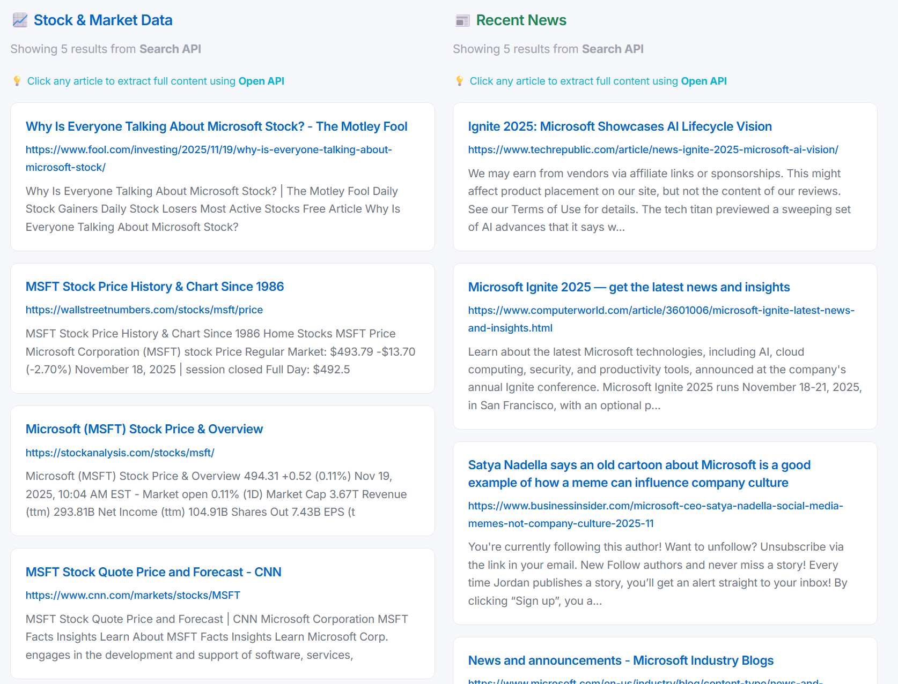
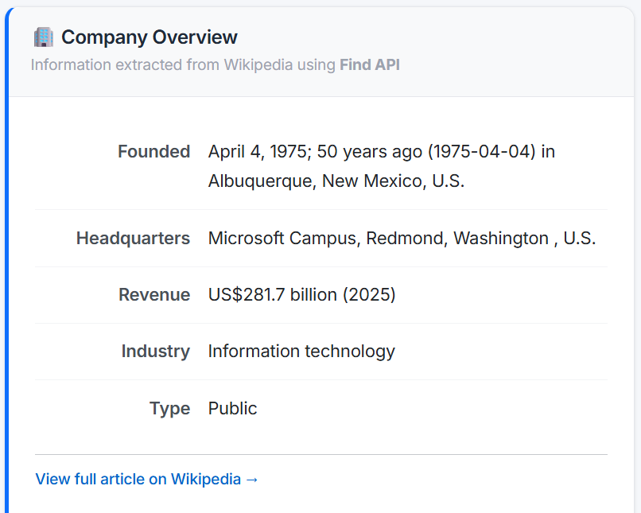
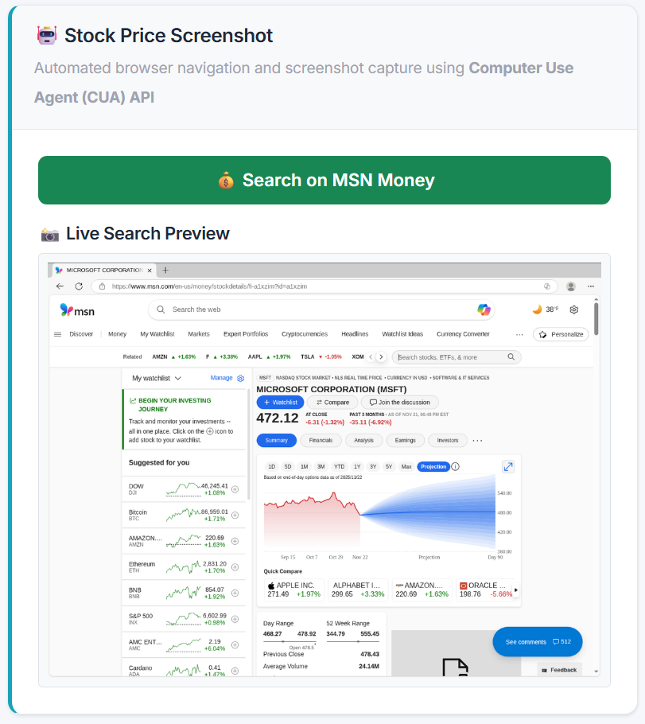
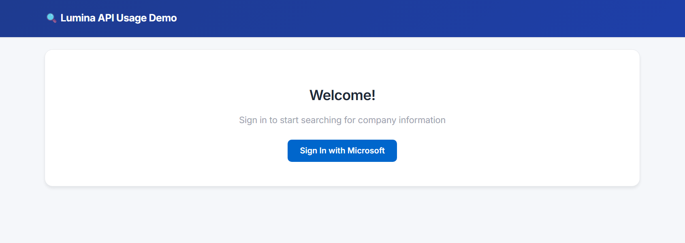
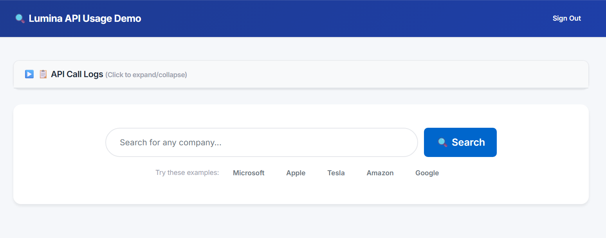
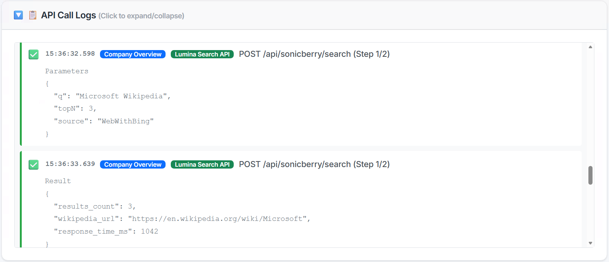
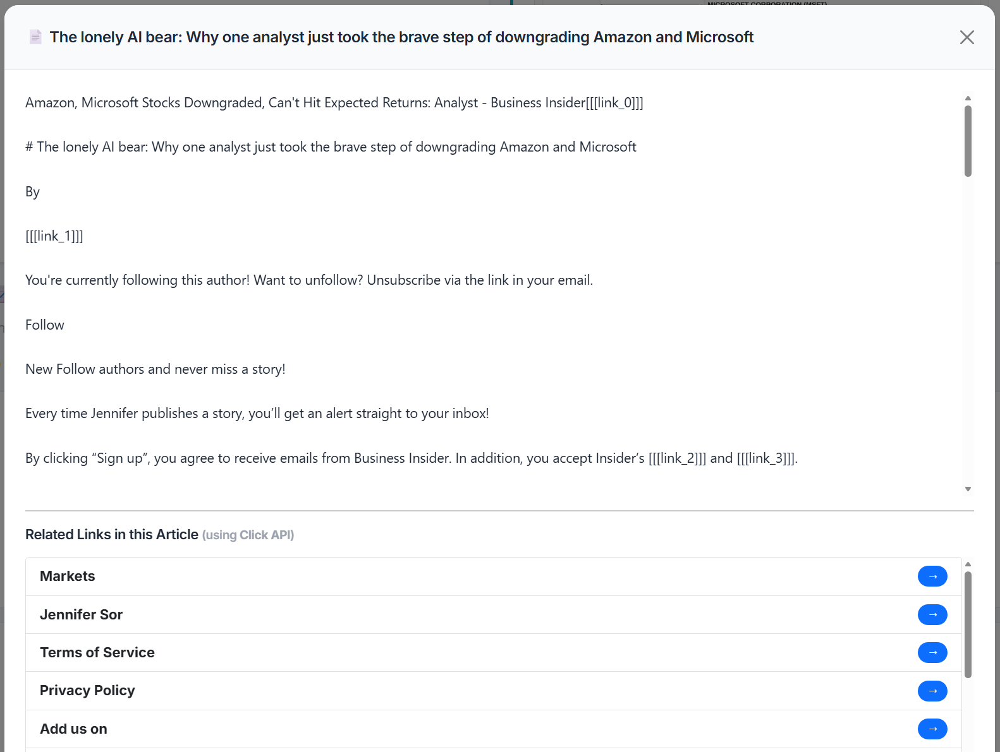

# Lumina API Demo Console

An educational sample application designed to help developers quickly learn and test Lumina API features. 

## Table of Contents
- [What This Demo Does](#what-this-demo-does)
- [Features](#features)
  - [Stock Market Data & Recent News](#-stock-market-data--recent-news)
  - [Company Overview](#-company-overview)
  - [Stock Price Screenshot](#-stock-price-screenshot)
- [Getting Started](#getting-started)
  - [Prerequisites](#prerequisites)
  - [Configuration Steps](#configuration-steps)
  - [Usage Guide](#usage-guide)
- [Code Structure](#code-structure)
- [API Endpoint Mapping](#api-endpoint-mapping)
- [Learning Each API](#learning-each-api)

## What This Demo Does

This demo showcases the raw capabilities of **Lumina APIs**—an AI infrastructure platform designed to empower agents with tools for searching, browsing, and interacting with the web.

**Note**: This application does **not** involve any LLM (Large Language Model) calls or AI reasoning. It purely demonstrates how to use Lumina as an infrastructure layer to retrieve and process information that an AI agent would typically consume.

Using **company name search** as a practical example, you can see how different Lumina APIs work together:

- **Search API** returns comprehensive results: stock information, news articles, and web pages
- **Open API** opens the company's website and extracts navigable links
- **Find API** extracts structured information (founding date, headquarters, revenue) from Wikipedia
- **Computer Use Agent API** automatically captures stock price chart screenshots

The web interface provides real-time logging so you can see the complete request/response flow for each API call.

## Features

### 📊 Stock Market Data & Recent News
**What it does**: Performs a batch search to retrieve stock-related information and recent news articles about a company in a single API call.



**APIs used**:
- **Search API (Batch)**: Sends two queries simultaneously:
  - Query 1: `"{company name} stock price"` - Returns stock market data and financial pages
  - Query 2: `"{company name} latest news"` - Returns recent news articles (past 7 days)
- Both queries use `WebWithBing` source with `Recency=7` filter for fresh results

**How to test**: Enter a company name (e.g., "Microsoft") and click "Search" button

### 📋 Company Overview
**What it does**: Extracts structured company information (founding date, headquarters, revenue, etc.) from the company's Wikipedia page.



**APIs used** (3-step workflow):
1. **Search API**: Searches for the company name with `domains: ["wikipedia.org"]` filter to restrict results to Wikipedia only
2. **Open API**: Opens the Wikipedia page and retrieves its content with a session ID
3. **Find API**: Searches within the page content for specific patterns like "Founded", "Headquarters", "Revenue" and extracts the information

**How to test**: Enter a company name and click "Search" - company overview will be automatically loaded and displayed in the left card

### 📈 Stock Price Screenshot
**What it does**: Automatically navigates to MSN Money, searches for the company, and captures a screenshot of the stock price chart.



The CUA API provides real-time progress updates during execution:


**APIs used**:
- **Computer Use Agent (CUA) API**:
  1. **Initialize**: Creates a virtual computer session (`/initialize`)
  2. **Actions**: Sends a sequence of commands (`/do`) to navigate and search
  3. **Screenshot**: Captures the final result (`/get`)
  4. **Release**: Frees the computer resource (`/release`)

**How to test**: After searching for a company, click "Stock Price Screenshot" button

## Getting Started

### Prerequisites

- **.NET 8.0 SDK** or higher
- **Lumina Environment Setup**: Complete the **Installation & Usage** and **Access** sections in the [Lumina Partner Documentation].

### Configuration Steps

#### 1. Clone the Repository

```bash
git clone https://github.com/yufanli_microsoft/Lumina-API-Demo.git
cd Lumina-API-Demo
```

#### 2. Configure Authentication

This demo uses the **On-Behalf-Of (OBO)** flow (implemented in `Services/OboTokenService.cs`).

- If you plan to use **OBO**, ensure your Azure AD App Registration is configured for it, and you can use the `OboTokenService` provided in this sample directly.
- If you need to use S2S or PFT, you and will need to implement your own token acquisition logic. Please refer to the Lumina documentation for implementation details.

#### 3. Create Configuration File

```bash
cd LuminaSearchConsole
cp appsettings.Template.json appsettings.json
```

Edit `appsettings.json` with your configuration:

```json
{
  "AzureAd": {
    "TenantId": "YOUR-TENANT-ID",
    "ClientId": "YOUR-CLIENT-ID",
    "RedirectUri": "YOUR-REDIRECT-URI"
  }
}
```

> **Note**: Ensure `RedirectUri` matches exactly what you configured in the Azure Portal.
> **Note**: `appsettings.json` is excluded in `.gitignore` and will not be committed to Git.

#### 4. Run the Application

```bash
# Restore NuGet packages
dotnet restore

# Build and run
dotnet run
```

The application will start at **http://localhost:8400**.

### Usage Guide

1. **Login**: First visit will redirect to Microsoft login page
   
   

   After successful login, you will see the main search console:

   

2. **Search Testing**: 
   - Use example buttons (Microsoft, Apple, Tesla...) for quick start
   - Or enter your own search keywords
   - View real-time logs (expandable section at the top) to understand API call flow

     

3. **Explore Other Features**:
   - Click **"Open Content"** button in search results to test Open API & Click API
     
     

   - Click **"Find Company Info"** button to test Find API
   - Click **"Stock Price Screenshot"** button to test CUA API

## Code Structure

```
.
├── Controllers/
│   └── HomeController.cs         # Main controller handling all page requests
│
├── Services/                     # Lumina API usage examples (core learning content)
│   ├── LuminaSearchService.cs    # Search API demo
│   ├── LuminaOpenService.cs      # Open & Click API demo
│   ├── LuminaFindService.cs      # Find API demo
│   ├── LuminaCuaService.cs       # Computer Use Agent API demo
│   ├── OboTokenService.cs        # MSAL authentication
│   ├── ApiLogService.cs          # Logging service for UI
│   ├── CuaComputerPool.cs        # Helper for CUA session management
│   └── SharedModels.cs           # Internal helper models
│
├── Models/                       # View models and business models
│   └── ViewModels.cs             # UI data models
│
├── Views/                        # Razor view pages
│   ├── Home/
│   │   └── Index.cshtml          # Main page
│   └── Shared/
│       ├── _Layout.cshtml        # Layout template
│       └── Error.cshtml          # Error page
│
├── wwwroot/                      # Static assets (CSS/JS)
│   ├── css/
│   └── js/
│
├── appsettings.Template.json     # Configuration template
├── AppConfiguration.cs           # Configuration class definitions
├── Program.cs                    # Application entry point
└── README.md                     # This file
```

## API Endpoint Mapping

This demo wraps Lumina API calls in C# Services. Here is the mapping to the actual REST endpoints:

| Service Class | Method | Lumina API Endpoint | Description |
|--------------|--------|---------------------|-------------|
| `LuminaSearchService` | `BatchSearchAsync` | `POST /api/sonicberry/search` | Performs batch search for multiple content types |
| `LuminaOpenService` | `OpenContentWithLinksAsync` | `POST /api/sonicberry/open` | Opens a URL and extracts content & links |
| `LuminaOpenService` | `ClickLinkAsync` | `POST /api/sonicberry/click` | Navigates to a link within an open session |
| `LuminaFindService` | `FindContentAsync` | `POST /api/sonicberry/find` | Finds specific information within a page |
| `LuminaCuaService` | `InitializeComputerAsync` | `POST /api/agent/computer/initialize` | Starts a new virtual computer session |
| `LuminaCuaService` | `PerformComputerActionsAsync` | `POST /api/agent/computer/do` | Executes keyboard/mouse actions |
| `LuminaCuaService` | `GetComputerScreenshotAsync` | `POST /api/agent/computer/get` | Captures the current screen state |

## Learning Each API

Each Service file contains detailed teaching comments:

### LuminaSearchService.cs
- **Purpose**: Demonstrates Search API batch and simple search
- **Key Methods**: 
  - `BatchSearchAsync()` - Batch search across multiple content types
  - `SimpleSearchAsync()` - Single content type search
- **How to Test**: Enter keywords on the main page, click "Search (Batch)" or "Search (Simple)"

### LuminaOpenService.cs
- **Purpose**: Demonstrates how to open web pages and extract links
- **Key Methods**: 
  - `OpenContentWithLinksAsync()` - Open URL and return content
  - `ClickLinkAsync()` - Navigate by clicking links
- **How to Test**: After searching, click "Open Content", then click any link on the page

### LuminaFindService.cs
- **Purpose**: Demonstrates how to find specific content within web pages
- **Key Methods**: 
  - `FindContentAsync()` - Use Find API to locate content
  - `ExtractCompanyInfoAsync()` - Extract company info (Wikipedia example)
- **How to Test**: After searching for a company, click "Find Company Info"

### LuminaCuaService.cs
- **Purpose**: Demonstrates Computer Use Agent automation capabilities
- **Key Methods**: 
  - `GetStockPriceScreenshotAsync()` - Capture stock price chart screenshot
- **How to Test**: After searching for a company, click "Stock Price Screenshot"

### OboTokenService.cs
- **Purpose**: Handles On-Behalf-Of (OBO) authentication
- **Key Methods**: 
  - `GetOboTokenAsync()` - Get access token for Lumina API
- **Features**: Automatic token caching and refresh on expiration

---

**Tip**: This program is designed to help you quickly understand how to use Lumina APIs. We recommend:
1. Run the program first and try out all features
2. Read the corresponding Service code to understand API call details
3. Reference the code examples when integrating Lumina APIs into your own projects
