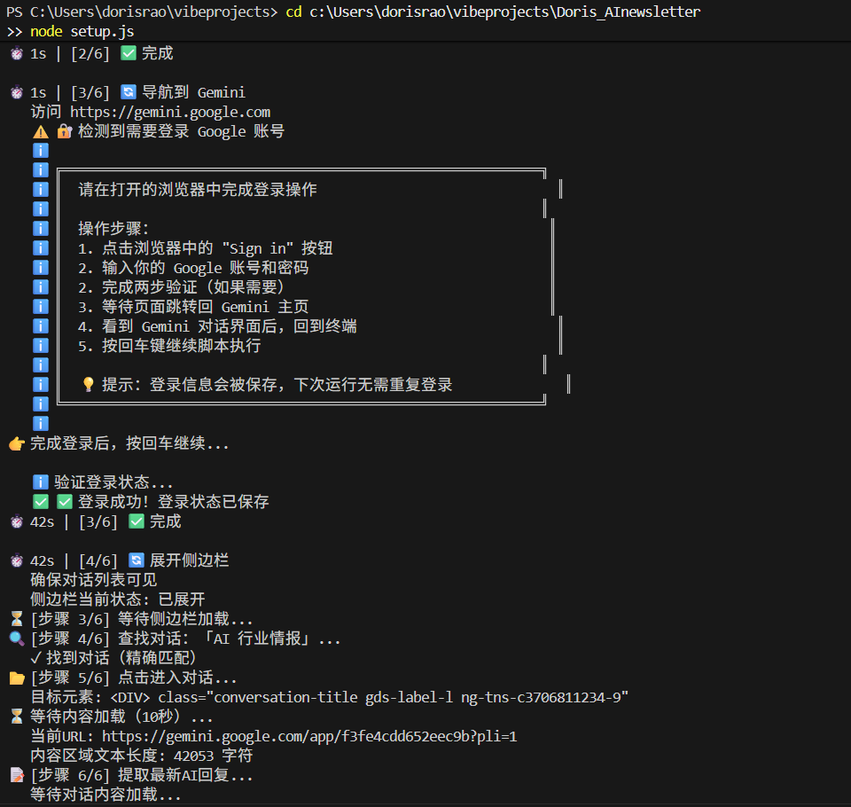

# 🚀 AI Radar - 自动化 AI 情报系统

**每天一键汇总全球最新 AI 动态，自动生成行业周报 + 音频播客，让你永远领先市场。**

---

## 📌 项目定位

AI Radar 是一套**自动化的 AI 行业情报系统**，专门为关注 AI 发展、需要及时掌握行业动态的专业人士打造。

### 核心价值
- ✅ **省时间** - 自动抓取+合并+生成摘要，从30分钟缩减到点击一次
- ✅ **不遗漏** - 一次汇总 ChatGPT、Gemini、Genspark 三大平台的最新观点
- ✅ **高质量** - 麦肯锡风格的精炼摘要，关键事实+洞察分析一目了然
- ✅ **可以听** - 自动生成音频，早晨通勤/健身时听最新行业动态
- ✅ **可定时** - 每天自动运行，无需人工干预

---

## 🎬 演示视频 & 截图

### 📹 完整功能演示

https://github.com/user-attachments/assets/a031e376-e8d9-4a50-9ac1-1e5936cc877e

> 👆 完整自动化流程演示：抓取 → 合并 → 生成摘要 → 上传音频

### 📸 运行效果截图



> 运行时清晰的进度日志，实时了解执行状态

---

## ✨ 核心功能

### 1. **多源汇总** 📡
- 同时从 ChatGPT、Google Gemini、Genspark 拉取指定对话内容
- 自动识别并提取关键信息（链接、数据完整保留）
- 支持自定义监听对话，灵活应对需求变化

### 2. **智能合并** 📋  
- 去重、排序、分类，生成一份统一的综合报告
- 保留原始来源标注，便于溯源

### 3. **精炼摘要** 📊
- **麦肯锡风格 HTML** - 核心数据表格、关键洞察、行动要点
- **结构化呈现** - 按类别分类（产品、安全、融资、技术等）
- **无需阅读全文** - 3分钟快速了解全周最新动态

### 4. **音频生成** 🎧
- 自动上传到 Google NotebookLM
- 生成专业音频播客，可随时收听
- 自动生成演示文稿 (PPT)

### 5. **定时自动化** ⏰
- macOS/Windows/Linux 都支持定时任务
- 支持 Siri 一键触发
- 日志完整记录，便于追踪执行状态

---

## 🎯 使用场景

| 场景 | 收益 |
|------|------|
| **AI 产品经理** | 每周快速掌握 AI 模型发展、Agent 框架更新 |
| **创业者** | 持续跟踪融资动态、行业机会，及时调整策略 |
| **投资人** | 定期输出行业周报，支撑决策论证 |
| **团队管理者** | 晨间同步会用数据说话，效率提升 30% |
| **学生/学者** | 快速追踪学术进展，论文选题更有针对性 |

---

## 🚀 快速开始（30秒上手）

### 步骤 1：一键安装

```bash
# 克隆项目
git clone <repo-url>
cd Auto_AInewsletter

# 运行安装引导（自动装依赖、登录、配置定时任务）
node setup.js
```

### 步骤 2：运行完整流程

```bash
npm run daily
```

**自动执行：** 抓取 → 合并 → 生成摘要 → 上传音频

### 步骤 3：查看结果

- 📊 摘要报告：`reports/summary-YYYY-MM-DD.html` 👈 **用浏览器打开查看**
- 📄 详细报告：`reports/combined-YYYY-MM-DD.md`
- 🎧 音频：NotebookLM 页面上已自动生成

---

## 📊 输出示例

每次运行后你会得到：

1. **HTML 摘要页面** - 麦肯锡风格，3分钟快速了解
   ```
   ┌─ 核心数据表（产品、融资、安全...）
   ├─ 关键洞察（Product、Enterprise、Infra...）
   ├─ 本周排名变化
   └─ 下周关注点
   ```

2. **完整 Markdown 报告** - 如需深度阅读
   - 中英文并行呈现
   - 所有链接完整保留
   - 支持导出转发

3. **音频播客** - NotebookLM 自动生成
   - 专业播音员朗读
   - 可随时暂停记笔记
   - 自动生成 PPT

---

## 📜 可用命令

| 命令 | 说明 |
|------|------|
| `npm run daily` | 🎯 **完整流程**：抓取 → 合并 → 摘要 → 上传 NotebookLM |
| `npm run scrape` | 仅抓取三个平台（不合并、不上传） |
| `npm run summary` | 仅生成 HTML 摘要 |
| `npm run chatgpt` | 单独抓取 ChatGPT |
| `npm run gemini` | 单独抓取 Gemini |
| `npm run genspark` | 单独抓取 Genspark |
| `npm run merge` | 合并报告 |
| `npm run upload` | 上传到 NotebookLM |

---

## 🏗️ 项目结构

```
Auto_AInewsletter/
├── 📄 核心脚本
│   ├── run_daily.js              # 主入口：每日自动化流程
│   ├── scrape_chatgpt_chrome.js  # ChatGPT 抓取器
│   ├── scrape_gemini_debug.js    # Gemini 抓取器
│   ├── scrape_genspark.js        # Genspark 抓取器
│   ├── merge_reports.js          # 报告合并器
│   ├── generate_summary.js       # HTML 摘要生成器
│   └── upload_notebooklm.js      # NotebookLM 上传器
│
├── 📄 安装配置
│   ├── setup.js                  # 安装引导脚本
│   ├── package.json              # npm 配置
│   └── .gitignore                # Git 忽略规则
│
├── 📁 数据目录（自动生成）
│   ├── reports/                  # 生成的报告
│   ├── logs/                     # 执行日志
│   └── chrome-data-*/            # 浏览器登录数据（敏感）
│
└── 📄 README.md
```

---

## 🔄 工作流程

```
┌─────────────────────────────────────────────────────────────┐
│                     npm run daily                            │
└─────────────────────────────────────────────────────────────┘
                              │
          ┌───────────────────┼───────────────────┐
          ▼                   ▼                   ▼
   ┌─────────────┐    ┌─────────────┐    ┌─────────────┐
   │  ChatGPT    │    │   Gemini    │    │  Genspark   │
   └─────────────┘    └─────────────┘    └─────────────┘
          │                   │                   │
          └───────────────────┼───────────────────┘
                              ▼
                    ┌─────────────────┐
                    │   合并报告       │
                    │ combined-*.md   │
                    └─────────────────┘
                              │
                    ┌─────────┴─────────┐
                    ▼                   ▼
          ┌─────────────────┐  ┌─────────────────┐
          │  生成 HTML 摘要  │  │ 上传 NotebookLM │
          │ summary-*.html  │  │   音频/演示文稿  │
          └─────────────────┘  └─────────────────┘
```

---

## 🛠️ 技术栈

- **Playwright** - 浏览器自动化抓取（支持登录状态记忆）
- **Node.js** - 核心运行环境
- **HTML/CSS** - 麦肯锡风格摘要页面
- **Google NotebookLM API** - 音频+演示文稿生成

---

## 📋 详细安装指南

### 前置要求
- **Node.js 18+** ([下载](https://nodejs.org/))
- **macOS / Windows / Linux** 任选
- 各平台账号已注册：
  - ChatGPT（开通 Plus/Pro）
  - Google Gemini
  - Genspark
  - Google NotebookLM

### macOS 安装步骤

```bash
# 1. 克隆项目
git clone <repo-url>
cd Auto_AInewsletter

# 2. 安装依赖
npm install
npx playwright install chromium

# 3. 首次运行（需手动登录）
node setup.js

# 4. 后续每天运行
npm run daily
```

### Windows 安装步骤

1. **安装必要工具**
   - Node.js 18+ (https://nodejs.org/)
   - Git (https://git-scm.com/downloads)

2. **克隆并安装**
   ```powershell
   git clone <repo-url>
   cd Auto_AInewsletter
   npm install
   npx playwright install chromium
   ```

3. **首次登录**
   ```powershell
   node setup.js
   npm run daily
   ```

4. **Windows 任务计划程序定时运行（可选）**
   - 打开"任务计划程序" → "创建基本任务"
   - 触发器：每日上午 9 点
   - 操作：启动程序
     - 程序/脚本：`C:\Program Files\nodejs\node.exe`
     - 添加参数：`run_daily.js`
     - 起始于：`C:\path\to\Auto_AInewsletter`

### Linux 安装步骤

```bash
# 1. 克隆项目
git clone <repo-url>
cd Auto_AInewsletter

# 2. 安装依赖
npm install
npx playwright install chromium

# 3. 首次运行
node setup.js

# 4. 添加 cron 定时任务
crontab -e
# 添加：0 9 * * * cd /path/to/Auto_AInewsletter && node run_daily.js >> logs/daily.log 2>&1
```

---

## ⏰ 定时任务管理

### macOS 
```bash
# 查看定时任务
launchctl list | grep airadar

# 手动触发
launchctl start com.airadar.daily

# 停用
launchctl unload ~/Library/LaunchAgents/com.airadar.daily.plist

# 重新启用
launchctl load ~/Library/LaunchAgents/com.airadar.daily.plist
```

### Mac Shortcuts 快捷指令（推荐）

1. 打开「快捷指令」应用
2. 创建新快捷指令，名称为 `AI Radar`
3. 添加「运行 Shell 脚本」，选择 `/bin/zsh`：
   ```bash
   cd /path/to/Auto_AInewsletter && /usr/local/bin/node run_daily.js >> logs/shortcut.log 2>&1
   ```
4. 保存后可通过：
   - **菜单栏** - 点击快捷指令 → 选择 AI Radar
   - **Spotlight** - `⌘ + 空格` → 输入 AI Radar
   - **Siri** - "Hey Siri, 运行 AI Radar"

---

## 🔒 安全与隐私

以下目录包含敏感数据，已添加到 `.gitignore`，不会上传到 Git：

- `chrome-data-*/` - 浏览器登录状态
- `auth/*.json` - 认证数据
- `logs/` - 执行日志

---

## ❓ 常见问题

### Q: 登录状态过期怎么办？

重新运行对应的抓取脚本即可：
```bash
npm run gemini    # 重新登录 Gemini
npm run chatgpt   # 重新登录 ChatGPT
npm run genspark  # 重新登录 Genspark
```

### Q: 如何修改抓取的对话？

编辑各抓取脚本顶部的 `CONFIG` 对象：

```javascript
// scrape_gemini_debug.js
const CONFIG = {
  TARGET_CHAT_TITLE: 'AI 行业情报',  // 改为你要监听的对话名称
};
```

### Q: 定时任务没有运行怎么办？

检查日志：
```bash
# macOS
launchctl list com.airadar.daily
tail -f ~/Library/Logs/airadar.log

# Windows
查看任务计划程序的历史记录

# Linux
tail -f logs/daily.log
```

### Q: 如何自定义摘要的分类？

编辑 `generate_summary.js` 中的分类配置，或修改 `merge_reports.js` 的合并规则。

---

## 📂 输出文件说明

| 文件 | 说明 |
|------|------|
| `report-chatgpt-YYYY-MM-DD.md` | ChatGPT 原始抓取 |
| `report-gemini-YYYY-MM-DD.md` | Gemini 原始抓取 |
| `report-genspark-YYYY-MM-DD.md` | Genspark 原始抓取 |
| `combined-YYYY-MM-DD.md` | 合并后的综合报告 |
| `summary-YYYY-MM-DD.html` | 🎨 **麦肯锡风格 HTML 摘要** |
| `summary-YYYY-MM-DD.md` | Markdown 版摘要 |

---

## 🤝 贡献

欢迎提交 Issue 和 Pull Request！

---

## 📄 License

MIT

---

Made with ❤️ by AI Radar
