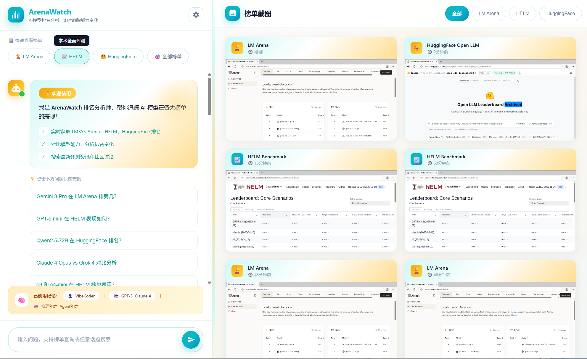
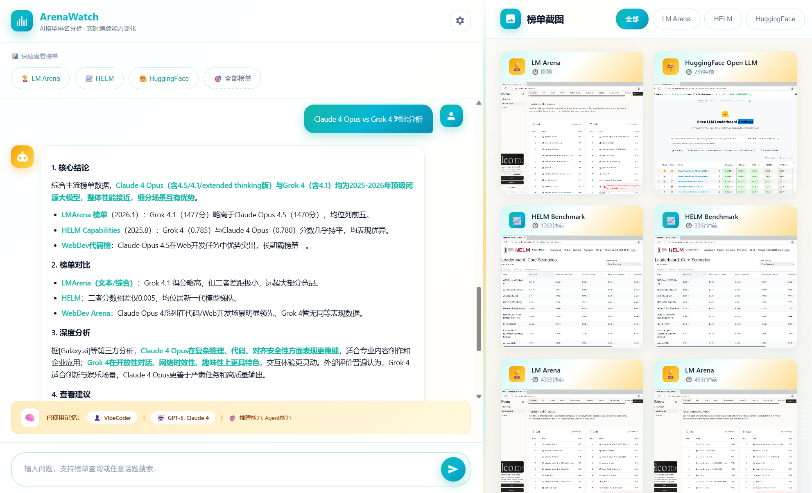
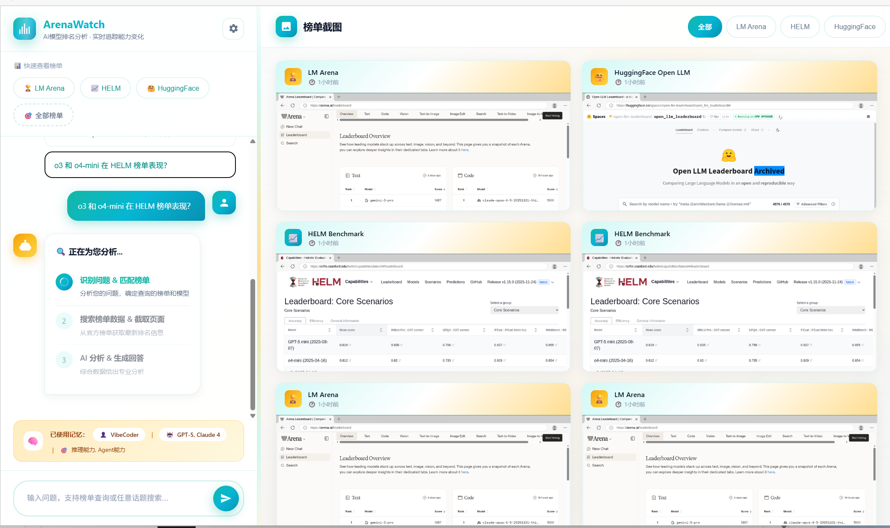
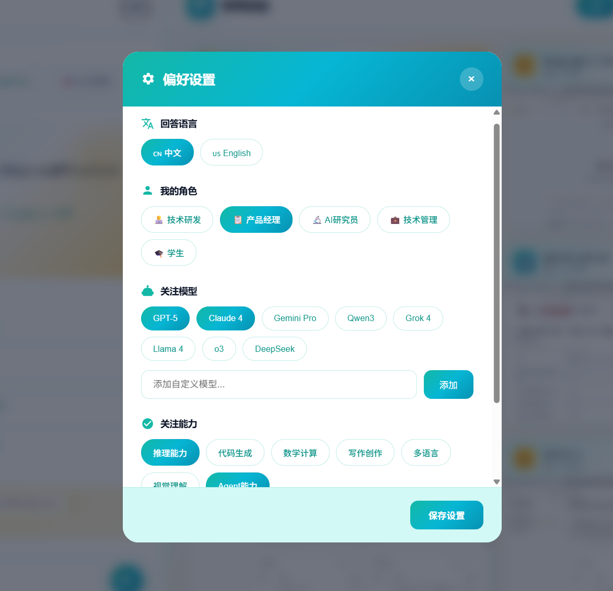
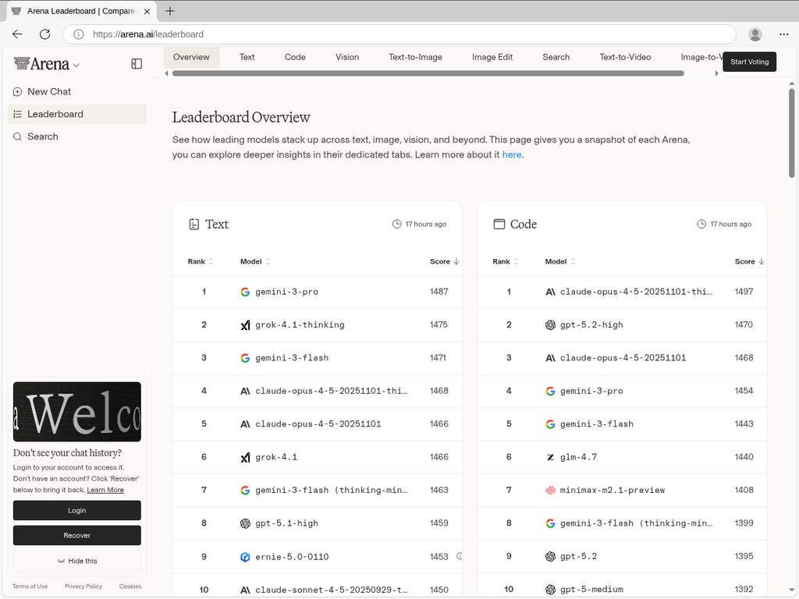
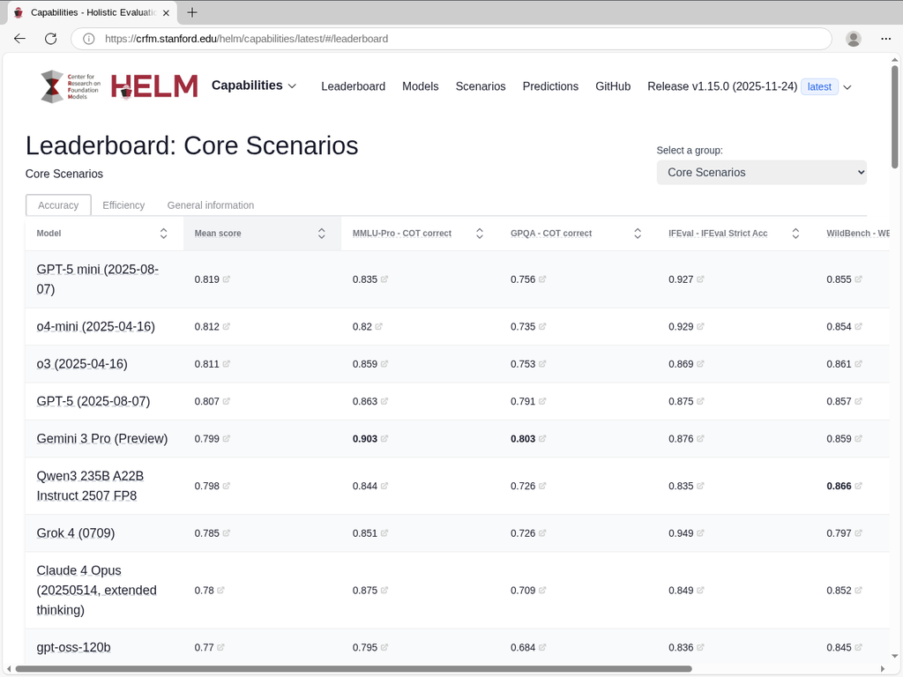
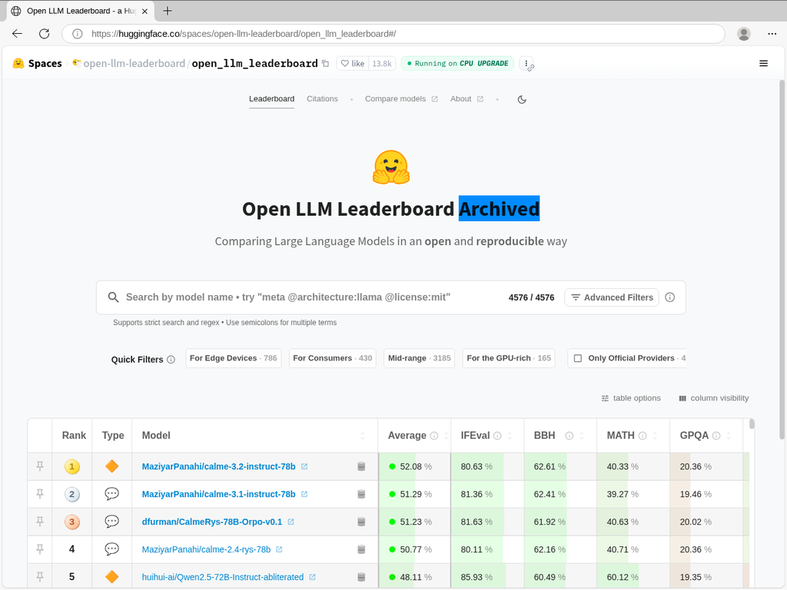

# ArenaWatch - AI 模型排名分析平台

[English](#english) | [中文](#中文)

---

<a name="中文"></a>
## 中文版

### 💡 一句话介绍

**ArenaWatch** 是一个基于 Lumina API 构建的 AI 模型排名分析平台 —— **用对话代替手动搜索，一句话获取 LM Arena、HELM、HuggingFace 多榜单、多模型的综合对比分析，支持个性化关注偏好设置，AI 智能记忆你的喜好，越用越懂你**。

---

### 🎯 核心价值

| 价值 | 说明 |
|:---:|------|
| 🔍 **多榜单聚合** | 自动抓取 LM Arena、HELM、HuggingFace 三大榜单，**不用手动一个个打开** |
| 🆚 **智能对比分析** | AI 综合分析模型能力，**轻松对比 GPT-5 vs Claude 4 vs Gemini** |
| ⚙️ **个性化偏好** | 设置关注模型和能力维度，**随时修改，AI 按偏好智能分析** |
| 🧠 **智能记忆** | 记住你关注的模型和偏好，**每次对话都更懂你** |
| 📸 **自动截图存档** | 榜单截图自动保存，**支持历史趋势对比** |

---

---

### 😫 你是否遇到过这些痛点？

| 痛点 | 传统方式 | ArenaWatch 解决方案 |
|------|---------|--------------------|
| 📊 **榜单太多看不过来** | 手动打开 LM Arena、HELM、HuggingFace... | 一句话查询，AI 自动汇总三大榜单 |
| 🔄 **排名经常变化** | 每次都要重新搜索、截图、对比 | 自动截图存档，支持历史对比 |
| 🤔 **不知道选哪个模型** | 逐个查看每个模型的评测结果 | AI 综合分析，给出推荐理由 |
| ⚙️ **想自定义关注重点** | 没法保存偏好，每次重新设置 | 设置关注模型和能力，随时修改 |
| 🧠 **每次都要重复说偏好** | 反复告诉 AI 你关注哪些模型 | 智能记忆，越用越懂你 |

---

### 👥 面向用户

| 角色 | 使用场景 |
|------|----------|
| 🎯 **产品经理** | 追踪竞品 AI 能力，为产品决策提供依据 |
| 💼 **技术负责人** | 评估不同模型性价比，选择最适合的 AI 服务 |
| 📈 **AI 研究员** | 跟踪学术基准榜单，了解前沿模型进展 |
| 🗣️ **管理层** | 快速获取 AI 领域执行摘要，支持战略决策 |

---


### 🖼️ 功能预览

#### 🏠 主界面：智能对话 + 榜单截图画廊


*左侧为智能对话区，支持自然语言查询,并推荐查询问题列表；右侧为榜单截图画廊，自动截取并展示历史记录*

---

#### 🧠 AI 智能分析：多榜单综合对比


*AI 自动汇总 LM Arena、HELM、HuggingFace 多榜单数据，给出综合对比分析和推荐建议*

---

#### 🔄 分析过程：透明的 AI 工作流程


*实时展示 AI 分析步骤：识别问题 → 匹配榜单 → 搜索数据 & 截取页面 → 生成回答，让你清楚了解 AI 的工作过程*

---

#### ⚙️ 偏好设置：自定义关注模型和能力维度


*设置你关注的模型（GPT-5、Claude 4、DeepSeek 等）和能力维度（推理、代码、数学等），AI 会按你的偏好智能分析*

---

#### 📸 榜单自动截图
| LM Arena | HELM Benchmark | HuggingFace |
|:--------:|:--------------:|:-----------:|
|  |  |  |
| 用户投票排名 | 学术评测基准 | 开源模型排名 |

---

### 📊 功能全景表

#### 🔧 Lumina API 能力

| API | 功能 | 使用场景 | 核心方法 |
|-----|------|---------|---------|
| **Search** | 智能搜索 | 搜索最新 AI 新闻、模型动态 | `SearchAsync(query, topN)` |
| **Open** | 网页抓取 | 打开 URL 获取完整内容 | `OpenAsync(url)` |
| **Find** | 内容定位 | 在页面中查找关键词 | `FindAsync(sessionId, pattern)` |
| **CUA** | 浏览器自动化 | 截图、点击、输入、滚动 | `CaptureScreenshotAsync(url)` |
| **LLM** | AI 对话 | 智能总结、分析报告生成 | `ChatAsync(message)` |

#### 🧠 记忆系统

| 功能 | 说明 |
|------|------|
| **Hard Memory** | 每次对话注入全部记忆，适合记忆少的场景 |
| **Conditional Memory** | AI 智能选择相关记忆注入，适合记忆多的场景 |
| **自动提取** | 从对话中自动识别值得记住的信息（身份、偏好、技能等） |
| **用户档案** | 存储用户基本信息、语言偏好、关注领域 |

#### 🏟️ ArenaWatch 特色

| 功能 | 说明 |
|------|------|
| **三大榜单支持** | LM Arena (用户投票)、HELM (学术基准)、HuggingFace (开源) |
| **截图画廊** | 自动截取并展示榜单截图，支持历史对比 |
| **个性化偏好** | 设置关注模型（GPT-5、Claude 4 等）和能力维度 |
| **执行摘要** | 生成专业分析报告，适合向 Leader 汇报 |

---

### 🛠️ 安装使用指南

<details>
<summary><b>🪟 Windows 安装指南</b>（点击展开）</summary>

#### 前置要求
- Windows 10/11
- VS Code（推荐）
- Git

#### 第一步：下载代码
在 VS Code 中按 `Ctrl + `` ` 打开终端，运行：
```powershell
git clone https://github.com/ai-microsoft/Lumina-API-Demo.git
cd Lumina-API-Demo
```

#### 第二步：一键安装环境
```powershell
.\Internal\setup.ps1
```
> ⏱️ 首次安装约 5-10 分钟，脚本会自动安装：
> - .NET 8 SDK
> - Node.js
> - Azure Artifacts Credential Provider

#### 第三步：登录并下载 Lumina 包
```powershell
dotnet restore --interactive
```
> 浏览器弹出后用 **@microsoft.com** 账号登录，登录成功后终端显示下载完成

#### 第四步：配置文件
```powershell
copy appsettings.Template.json appsettings.json
```
用记事本或 VS Code 编辑 `appsettings.json`，填入：
```json
{
  "TenantId": "你的租户ID",
  "ClientId": "你的客户端ID",
  "RedirectUri": "http://localhost"
}
```

#### 第五步：启动 Copilot API
点击 VS Code 终端右上角 **+** 新建终端，运行：
```powershell
npx copilot-api@0.5.14 start
```
> ⚠️ 首次运行需要 GitHub 授权：
> 1. 终端显示 `Please enter the code "XXXX-XXXX" in https://github.com/login/device`
> 2. 打开浏览器访问该网址，输入代码
> 3. 点击授权，返回终端看到启动成功
> 4. **保持这个终端运行，不要关闭！**

#### 第六步：启动应用
再新建一个终端，运行：
```powershell
dotnet run
```

#### 第七步：开始使用！
🎉 打开浏览器访问 **http://localhost:8400**

</details>

<details>
<summary><b>🍎 macOS 安装指南</b>（点击展开）</summary>

#### 前置要求
- macOS 12+
- VS Code（推荐）
- Git
- Homebrew（推荐）

#### 第一步：安装依赖工具
```bash
# 安装 Homebrew（如果没有）
/bin/bash -c "$(curl -fsSL https://raw.githubusercontent.com/Homebrew/install/HEAD/install.sh)"

# 安装 .NET 8 SDK
brew install dotnet@8

# 安装 Node.js
brew install node

# 安装 Azure Artifacts Credential Provider
brew tap azure/azure-cli
brew install azure-cli
az extension add --name artifacts-keyring
```

#### 第二步：下载代码
```bash
git clone https://github.com/ai-microsoft/Lumina-API-Demo.git
cd Lumina-API-Demo
```

#### 第三步：登录并下载 Lumina 包
```bash
dotnet restore --interactive
```
> 浏览器弹出后用 **@microsoft.com** 账号登录

#### 第四步：配置文件
```bash
cp appsettings.Template.json appsettings.json
```
编辑 `appsettings.json`：
```bash
# 使用 VS Code 编辑
code appsettings.json

# 或使用 nano
nano appsettings.json
```
填入你的配置：
```json
{
  "TenantId": "你的租户ID",
  "ClientId": "你的客户端ID",
  "RedirectUri": "http://localhost"
}
```

#### 第五步：启动 Copilot API
打开新终端窗口（`Cmd + T`），运行：
```bash
npx copilot-api@0.5.14 start
```
> ⚠️ 首次运行需要 GitHub 授权，按终端提示操作
> **保持这个终端运行，不要关闭！**

#### 第六步：启动应用
再打开一个新终端，运行：
```bash
dotnet run
```

#### 第七步：开始使用！
🎉 打开浏览器访问 **http://localhost:8400**

</details>


---

### 🎨 典型使用场景

#### 🏆 场景一：快速了解模型排名格局
**你说**："帮我看看最新的 AI 模型排名，GPT-5 和 Claude 4 哪个更强？"

**ArenaWatch 自动**：
```
📸 截取三大榜单截图 → 🔍 识别各榜单排名 → 📊 生成对比分析表格 → 💡 给出综合推荐
```

**输出示例**：
> "根据最新数据，在 LM Arena 用户投票榜中 Claude 4 排名第1，GPT-5 第2；但在 HELM 学术基准中 GPT-5 在推理任务上得分更高。如果你重视用户体验，推荐 Claude 4；如果重视推理能力，推荐 GPT-5。"

---

#### 📈 场景二：多模型能力对比
**你说**："对比一下 DeepSeek V3、Kimi 2.5、Gemini Pro 3 在代码生成方面的能力"

**ArenaWatch 自动**：
```
🔍 搜索各模型代码能力评测 → 📊 汇总对比数据 → 📝 生成专业分析报告
```

**为什么比手动搜索强？**
- ❌ 手动：打开5个网页 → 找到相关评测 → 复制数据 → 自己对比整理（30分钟+）
- ✅ ArenaWatch：一句话 → 自动完成 → 获得专业报告（30秒）

---

#### 📋 场景三：给 Leader 准备汇报材料
**你说**："帮我准备一份 AI 模型排名的执行摘要，用于明天的周会汇报"

**ArenaWatch 自动**：
```
📸 截取最新榜单 → 📊 分析排名变化 → 📝 生成麦肯锡风格 PPT 要点
```

**输出包含**：
- 本周排名变化亮点
- 重点模型动态
- 对我们的启示和建议
- 配图截图

---

#### 🧠 场景四：个性化持续追踪
**你说**："我主要关注 DeepSeek 和 Kimi，以后每次都帮我重点看这两个"

**ArenaWatch 记住你的偏好**：
- 下次你问"最新排名怎么样"，自动优先展示 DeepSeek 和 Kimi
- 生成报告时，重点分析这两个模型
- 越用越懂你，不用每次重复说明

---

### 📁 项目结构

```
Lumina-API-Demo/
├── Program.cs              # 主程序，定义所有 API 路由
├── SearchApi.cs            # 搜索功能
├── OpenApi.cs              # 网页抓取
├── FindApi.cs              # 内容定位
├── CuaApi.cs               # 浏览器自动化
├── LlmExample.cs           # LLM 集成 + 记忆注入
├── MemoryService.cs        # 记忆管理核心
├── MemoryExtractionService.cs  # 自动记忆提取
├── Services/
│   ├── ArenaService.cs     # Arena 问答服务
│   └── ArenaMonitor.cs     # 榜单分析报告生成
├── wwwroot/
│   ├── index.html          # ArenaWatch 界面
│   └── screenshots/        # 榜单截图存储
└── docs/                   # 文档
```

---

### 📞 下一步行动

- [ ] 打开 http://localhost:8400 体验 ArenaWatch
- [ ] 尝试问一些榜单问题，看 AI 如何回答
- [ ] 在设置中配置你关注的模型
- [ ] 用 Vibe Coding 扩展更多功能！

---

### ❓ 遇到问题？

把错误信息复制给 **Coding Agent**，它可以帮你排查！

---
---

<a name="english"></a>
## English Version

### 💡 One-Line Introduction

**ArenaWatch** is an AI model ranking analysis platform built on Lumina API — **Replace manual searching with conversation, get comprehensive comparison analysis across LM Arena, HELM, HuggingFace leaderboards, with customizable focus preferences that AI remembers and learns from**.

---

### 😫 Pain Points We Solve

| Pain Point | Traditional Way | ArenaWatch Solution |
|------------|-----------------|---------------------|
| 📊 **Too many leaderboards** | Manually open LM Arena, HELM, HuggingFace... | One query, AI summarizes all three |
| 🔄 **Rankings change frequently** | Search, screenshot, compare every time | Auto-screenshot with history comparison |
| 🤔 **Which model to choose?** | Check each model's benchmarks one by one | AI comprehensive analysis with recommendations |
| ⚙️ **Want custom focus** | Can't save preferences, reset every time | Set focus models & capabilities, modify anytime |
| 🧠 **Repeating preferences** | Tell AI your focus models every time | Smart memory, learns your preferences |

---

### 👥 Target Users

| Role | Use Case |
|------|----------|
| 🎯 **Product Managers** | Track competitor AI capabilities for product decisions |
| 💼 **Tech Leaders** | Evaluate model cost-effectiveness, choose the right AI service |
| 📈 **AI Researchers** | Follow academic benchmarks, stay updated on frontier models |
| 🗣️ **Executives** | Get AI landscape executive summaries for strategic decisions |

---

### 🎯 Core Value Propositions

| Value | Description |
|:-----:|-------------|
| 🔍 **Multi-Leaderboard Aggregation** | Auto-capture LM Arena, HELM, HuggingFace — **no manual tab switching** |
| 🆚 **Smart Comparison Analysis** | AI analyzes model capabilities, **easily compare GPT-5 vs Claude 4 vs Gemini** |
| ⚙️ **Personalized Preferences** | Set focus models & capability dimensions, **modify anytime, AI analyzes based on your preferences** |
| 🧠 **Smart Memory** | Remembers your focus models and preferences, **gets smarter each conversation** |
| 📸 **Auto Screenshot Archive** | Leaderboard screenshots auto-saved, **supports historical trend comparison** |

---

### 🖼️ Feature Preview

#### 🏠 Main Interface: Smart Chat + Screenshot Gallery


*Left: Smart chat area with natural language queries | Right: Screenshot gallery with auto-captured history*

---

#### 🧠 AI Smart Analysis: Multi-Leaderboard Comparison


*AI automatically aggregates LM Arena, HELM, HuggingFace data, provides comprehensive comparison and recommendations*

---

#### 🔄 Analysis Process: Transparent AI Workflow


*Real-time display of AI analysis steps: Identify question → Match leaderboards → Search data & Capture pages → Generate answer, so you understand exactly how AI works*

---

#### ⚙️ Preference Settings: Customize Focus Models & Capabilities


*Set your focus models (GPT-5, Claude 4, DeepSeek, etc.) and capability dimensions (Reasoning, Coding, Math, etc.), AI analyzes based on your preferences*

---

#### 📸 Auto-captured Leaderboards
| LM Arena | HELM Benchmark | HuggingFace |
|:--------:|:--------------:|:-----------:|
|  |  |  |
| User voting rankings | Academic benchmarks | Open-source rankings |

---

### 📊 Feature Overview

#### 🔧 Lumina API Capabilities

| API | Function | Use Case | Core Method |
|-----|----------|----------|-------------|
| **Search** | Smart search | Search latest AI news, model updates | `SearchAsync(query, topN)` |
| **Open** | Web scraping | Open URL to get full content | `OpenAsync(url)` |
| **Find** | Content location | Find keywords in pages | `FindAsync(sessionId, pattern)` |
| **CUA** | Browser automation | Screenshot, click, type, scroll | `CaptureScreenshotAsync(url)` |
| **LLM** | AI conversation | Smart summarization, report generation | `ChatAsync(message)` |

#### 🧠 Memory System

| Feature | Description |
|---------|-------------|
| **Hard Memory** | Inject all memories every conversation, for fewer memories |
| **Conditional Memory** | AI selects relevant memories to inject, for many memories |
| **Auto Extraction** | Auto-identify memorable info from conversations (identity, preferences, skills) |
| **User Profile** | Store user info, language preferences, focus areas |

#### 🏟️ ArenaWatch Features

| Feature | Description |
|---------|-------------|
| **Three Leaderboards** | LM Arena (user votes), HELM (academic), HuggingFace (open-source) |
| **Screenshot Gallery** | Auto-capture and display leaderboard screenshots with history |
| **Personalized Preferences** | Set focus models (GPT-5, Claude 4, etc.) and capability dimensions |
| **Executive Summary** | Generate professional analysis reports for leadership |

---

### 🛠️ Installation Guide

<details>
<summary><b>🪟 Windows Installation</b> (Click to expand)</summary>

#### Prerequisites
- Windows 10/11
- VS Code (recommended)
- Git

#### Step 1: Clone the Code
Open terminal in VS Code (`Ctrl + ``), run:
```powershell
git clone https://github.com/ai-microsoft/Lumina-API-Demo.git
cd Lumina-API-Demo
```

#### Step 2: One-Click Environment Setup
```powershell
.\Internal\setup.ps1
```
> ⏱️ First-time setup takes ~5-10 minutes, auto-installs:
> - .NET 8 SDK
> - Node.js
> - Azure Artifacts Credential Provider

#### Step 3: Login and Download Lumina Package
```powershell
dotnet restore --interactive
```
> Login with your **@microsoft.com** account when browser opens

#### Step 4: Configure
```powershell
copy appsettings.Template.json appsettings.json
```
Edit `appsettings.json` with Notepad or VS Code:
```json
{
  "TenantId": "your-tenant-id",
  "ClientId": "your-client-id",
  "RedirectUri": "http://localhost"
}
```

#### Step 5: Start Copilot API
Click **+** in VS Code terminal to create new terminal, run:
```powershell
npx copilot-api@0.5.14 start
```
> ⚠️ First run requires GitHub authorization:
> 1. Terminal shows `Please enter the code "XXXX-XXXX" in https://github.com/login/device`
> 2. Open browser to that URL, enter the code
> 3. Click authorize, return to terminal to see success
> 4. **Keep this terminal running, don't close!**

#### Step 6: Start Application
Create another new terminal, run:
```powershell
dotnet run
```

#### Step 7: Start Using!
🎉 Open browser and visit **http://localhost:8400**

</details>

<details>
<summary><b>🍎 macOS Installation</b> (Click to expand)</summary>

#### Prerequisites
- macOS 12+
- VS Code (recommended)
- Git
- Homebrew (recommended)

#### Step 1: Install Dependencies
```bash
# Install Homebrew (if not installed)
/bin/bash -c "$(curl -fsSL https://raw.githubusercontent.com/Homebrew/install/HEAD/install.sh)"

# Install .NET 8 SDK
brew install dotnet@8

# Install Node.js
brew install node

# Install Azure Artifacts Credential Provider
brew tap azure/azure-cli
brew install azure-cli
az extension add --name artifacts-keyring
```

#### Step 2: Clone the Code
```bash
git clone https://github.com/ai-microsoft/Lumina-API-Demo.git
cd Lumina-API-Demo
```

#### Step 3: Login and Download Lumina Package
```bash
dotnet restore --interactive
```
> Login with your **@microsoft.com** account when browser opens

#### Step 4: Configure
```bash
cp appsettings.Template.json appsettings.json
```
Edit `appsettings.json`:
```bash
# Using VS Code
code appsettings.json

# Or using nano
nano appsettings.json
```
Fill in your configuration:
```json
{
  "TenantId": "your-tenant-id",
  "ClientId": "your-client-id",
  "RedirectUri": "http://localhost"
}
```

#### Step 5: Start Copilot API
Open new terminal window (`Cmd + T`), run:
```bash
npx copilot-api@0.5.14 start
```
> ⚠️ First run requires GitHub authorization, follow terminal prompts
> **Keep this terminal running, don't close!**

#### Step 6: Start Application
Open another new terminal, run:
```bash
dotnet run
```

#### Step 7: Start Using!
🎉 Open browser and visit **http://localhost:8400**

</details>


---

### 🎨 Typical Use Cases

#### 🏆 Scenario 1: Quick Model Ranking Overview
**You say**: "Show me the latest AI model rankings, which is better - GPT-5 or Claude 4?"

**ArenaWatch auto**:
```
📸 Screenshot three leaderboards → 🔍 Identify rankings → 📊 Generate comparison table → 💡 Give recommendations
```

**Example output**:
> "Based on latest data, Claude 4 ranks #1 in LM Arena user votes, GPT-5 #2; but in HELM academic benchmarks, GPT-5 scores higher on reasoning tasks. For user experience, recommend Claude 4; for reasoning capability, recommend GPT-5."

---

#### 📈 Scenario 2: Multi-Model Capability Comparison
**You say**: "Compare DeepSeek V3, Kimi 2.5, Gemini Pro 3 in code generation"

**ArenaWatch auto**:
```
🔍 Search each model's coding benchmarks → 📊 Aggregate comparison data → 📝 Generate professional report
```

**Why better than manual search?**
- ❌ Manual: Open 5 tabs → Find relevant benchmarks → Copy data → Compare yourself (30+ min)
- ✅ ArenaWatch: One sentence → Auto complete → Get professional report (30 sec)

---

#### 📋 Scenario 3: Prepare Executive Briefing
**You say**: "Prepare an AI model ranking executive summary for tomorrow's meeting"

**ArenaWatch auto**:
```
📸 Screenshot latest rankings → 📊 Analyze ranking changes → 📝 Generate McKinsey-style bullet points
```

**Output includes**:
- This week's ranking highlights
- Key model updates
- Implications and recommendations
- Supporting screenshots

---

#### 🧠 Scenario 4: Personalized Continuous Tracking
**You say**: "I mainly follow DeepSeek and Kimi, always prioritize these two"

**ArenaWatch remembers your preferences**:
- Next time you ask "what's the latest ranking", auto-prioritizes DeepSeek and Kimi
- Reports focus analysis on these two models
- Gets smarter over time, no need to repeat

---

### 📁 Project Structure

```
Lumina-API-Demo/
├── Program.cs              # Main program, defines all API routes
├── SearchApi.cs            # Search functionality
├── OpenApi.cs              # Web scraping
├── FindApi.cs              # Content location
├── CuaApi.cs               # Browser automation
├── LlmExample.cs           # LLM integration + memory injection
├── MemoryService.cs        # Memory management core
├── MemoryExtractionService.cs  # Auto memory extraction
├── Services/
│   ├── ArenaService.cs     # Arena Q&A service
│   └── ArenaMonitor.cs     # Leaderboard analysis report generation
├── wwwroot/
│   ├── index.html          # ArenaWatch interface
│   └── screenshots/        # Leaderboard screenshot storage
└── docs/                   # Documentation
```

---

### 📞 Next Steps

- [ ] Open http://localhost:8400 to experience ArenaWatch
- [ ] Try asking some leaderboard questions
- [ ] Configure your focus models in settings
- [ ] Extend more features with Vibe Coding!

---

### ❓ Having Issues?

Copy the error message to **Coding Agent**, it can help troubleshoot!

---

## Partner Context

Partner Context is used for API telemetry and quota management.

```json
{
  "PartnerContext": {
    "Partner": "Your Partner Name",
    "ScenarioGroup": "Your Scenario Group",
    "ScenarioName": "Your Scenario Name"
  }
}
```

Configure in `appsettings.json`. Fields are hierarchical - cannot skip levels.

