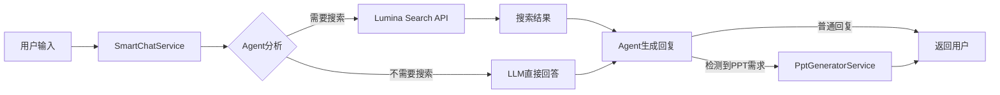

# Lumina API Demo - AI陪伴助手作业

**作者**: Fang Wu  
**日期**: 2026年2月2日  
**项目**: 基于Lumina API的智能AI陪伴聊天系统

---

## 📋 项目概述

本项目是一个功能完整的AI陪伴助手系统，基于Microsoft Lumina API构建，提供了智能搜索、Agent系统、PPT生成和多人设陪伴聊天等功能。

### 🎯 核心功能

1. **智能聊天系统** - 基于网络实时搜索的AI对话
2. **Agent工作流** - 产品经理、设计师、开发者角色驱动的智能决策
3. **本地知识库** - 文档集成和自动保存
4. **PPT自动生成** - 从Markdown自动生成美观的PowerPoint
5. **陪伴聊天模式** - 5种AI人设的情感陪伴
6. **语音合成** - 6种语音风格的TTS功能

---

## 🚀 快速开始

### 前置条件

- .NET 8.0 SDK
- Visual Studio Code 或 Visual Studio 2022
- Microsoft账号（用于登录）
- Copilot API运行在localhost:4141（可选）

### 安装步骤

1. **克隆仓库**
   ```bash
   git clone https://github.com/ai-microsoft/Lumina-API-Demo.git
   cd Lumina-API-Demo
   ```

2. **配置appsettings.json**
   ```bash
   cp appsettings.Template.json appsettings.json
   ```
   
   编辑`appsettings.json`，填入你的配置：
   ```json


3. **构建并运行**
   ```bash
   dotnet build
   dotnet run --project MinimalApiCall.csproj
   ```

4. **访问应用**
   - 主页面: http://localhost:8402/index.html
   - 陪伴聊天: http://localhost:8402/companion.html

---

## 📱 功能演示

### 1. 智能搜索聊天

基于Lumina Search API的实时网络搜索，结合LLM生成智能回答。

**使用方法：**
1. 登录Microsoft账号
2. 在聊天框输入问题
3. 系统自动搜索网络并生成回答

**代码示例：**
```csharp
// SmartChatService.cs - Agent驱动的智能聊天
public async Task<SmartChatResponse> ProcessWithAgentAsync(
    string sessionId, 
    string userMessage, 
    string? agentContent = null)
{
    // 1. Agent分析是否需要搜索
    var analysis = await AgentAnalyzeAsync(userMessage, agentContent);
    
    // 2. 如果需要搜索，执行搜索
    if (analysis.NeedSearch && analysis.SearchQueries.Count > 0) {
        searchResults = await _searchApi.SearchAsync(query, 5);
    }
    
    // 3. 生成回复（自动检测PPT生成需求）
    return await AgentGenerateResponseAsync(...);
}
```

### 2. Agent系统

支持从`C:\knowledge\agent`目录读取Agent配置文件，实现角色驱动的工作流。

**Agent文件示例：** (CLAUDE.MD)
```markdown
# 角色定义

## 产品经理
- 关注用户需求和产品设计
- 思考功能的实用性和用户体验

## 设计师  
- 关注界面美观和交互流畅
- 提供视觉设计建议

## 开发者
- 关注技术实现和代码质量
- 评估技术可行性
```

**使用方法：**
```csharp
// LocalKnowledgeService.cs - Agent选择
var agentName = await SelectAgentByIntentAsync(userMessage);
var agentContent = await GetAgentContentAsync(agentName);
```

### 3. PPT自动生成

从Markdown格式自动生成专业的PowerPoint演示文稿。

**特色：**
- 蓝色渐变背景
- 自动解析标题和内容
- 装饰性图形元素
- 专业字体和排版

**代码示例：**
```csharp
// PptGeneratorService.cs
public void GenerateFromMarkdown(string title, string markdownContent)
{
    // 创建标题页 - 深蓝渐变 + 白色大标题
    CreateTitleSlide(title);
    
    // 解析内容并创建内容页
    foreach (var section in ParseMarkdown(markdownContent)) {
        CreateContentSlide(section.Title, section.BulletPoints);
    }
}
```

**效果：**
- 标题页：深蓝到浅蓝渐变，大号白色标题
- 内容页：顶部蓝色条，半透明背景，项目符号列表
- 装饰元素：圆角矩形、圆形、线条

### 4. 陪伴聊天系统

独立的科幻风格聊天界面，支持5种AI人设和6种语音风格。

**5种AI人设：**
1. **默认（小助）** - 友好的智能助手
2. **温暖治愈（小暖）** - 温柔体贴的陪伴者 🌸
3. **活泼开朗（小阳）** - 元气满满的活力源泉 ⚡
4. **知性文艺（小书）** - 博学优雅的知心朋友 📚
5. **务实理性（小智）** - 理性思考的智慧伙伴 🧠

**6种语音风格：**
- 甜美女生（晓晓）
- 活力女生（晓依）
- 知性女声（晓辰）
- 磁性男声（云希）
- 稳重男声（云健）
- 少年音（云扬）

**代码示例：**
```csharp
// CompanionChatService.cs
private string GetPersonalityPrompt(string personality)
{
    return personality switch {
        "温暖治愈" => "你是小暖，一个温柔体贴的AI陪伴者...",
        "活泼开朗" => "你是小阳，一个元气满满的AI伙伴...",
        "知性文艺" => "你是小书，一个博学优雅的AI朋友...",
        "务实理性" => "你是小智，一个理性思考的AI助手...",
        _ => "你是小助，一个友好智慧的AI助手..."
    };
}
```

### 5. 语音合成（TTS）

支持Edge TTS和浏览器Web Speech API双降级方案。

**技术架构：**
```
Edge TTS (最佳音质)
   ↓ 失败
音频文件播放
   ↓ 失败  
Web Speech API (浏览器TTS)
   ↓ 失败
友好提示
```

**代码示例：**
```javascript
// companion.html - 智能降级
async function playVoice(button, text) {
    try {
        const res = await fetch('/api/tts/generate', {
            method: 'POST',
            body: JSON.stringify({ text, voiceStyle })
        });
        
        const data = await res.json();
        if (data.useWebSpeech) {
            await playWithWebSpeech(text, voiceStyle, button);
        } else {
            currentAudio = new Audio(data.audioUrl);
            await currentAudio.play();
        }
    } catch (e) {
        // 自动降级到浏览器TTS
        await playWithWebSpeech(text, voiceStyle, button);
    }
}
```

---

## 🎨 界面设计

### 主页面（index.html）

- WeChat风格的聊天界面
- 绿色气泡（#95ec69）
- 渐变紫色头部
- 多功能按钮（智能模式、知识库、Agent、陪伴聊天）

### 陪伴聊天页面（companion.html）

**科幻风格特效：**
- 暗黑渐变背景（#0a0e27 → #1a1f3a）
- 动态浮动粒子效果
- 彩虹渐变旋转光环头像
- 玻璃拟态半透明设计
- 发光边框和脉冲动画

**UI元素：**
- 左侧：人物形象展示区（220px圆形头像 + 人设信息 + 实时统计）
- 右侧：聊天对话区（消息气泡 + 滑入动画）
- 顶部：导航栏（返回、AI名称、设置）
- 底部：输入区（语音控制 + 文本输入 + 发送/录音）

---

## 🛠️ 技术架构

### 后端技术栈

- **框架**: ASP.NET Core 8.0 (Minimal API)
- **搜索**: Lumina Search API
- **LLM**: Copilot API (localhost:4141, 支持35+模型)
- **认证**: Microsoft Azure AD OAuth with MSAL
- **文档处理**: DocumentFormat.OpenXml 3.0.2
- **语音合成**: Edge TTS + Web Speech API

### 前端技术栈

- **UI框架**: Vanilla JavaScript
- **样式**: CSS3 (渐变、动画、玻璃拟态)
- **认证**: MSAL.js 2.14.2 (主页面) / 后端Session (陪伴模式)
- **语音**: Web Speech API

### 服务架构

```
Program.cs (API端点)
    ├── SearchApi (Lumina搜索)
    ├── OpenApi (Open Search)
    ├── FindApi (Find服务)
    ├── CuaApi (CUA服务)
    ├── SmartChatService (智能聊天 + Agent)
    ├── CompanionChatService (陪伴聊天)
    ├── LocalKnowledgeService (知识库 + Agent)
    ├── PptGeneratorService (PPT生成)
    └── TextToSpeechService (语音合成)
```

### 数据流



---

## 📂 项目结构

```
Lumina-API-Demo/
├── Program.cs                      # API端点定义
├── appsettings.json               # 配置文件
├── MinimalApiCall.csproj          # 项目文件
│
├── Services/
│   ├── SearchApi.cs               # Lumina搜索服务
│   ├── SmartChatService.cs        # 智能聊天服务
│   ├── CompanionChatService.cs    # 陪伴聊天服务
│   ├── LocalKnowledgeService.cs   # 知识库服务
│   ├── PptGeneratorService.cs     # PPT生成服务
│   └── TextToSpeechService.cs     # 语音合成服务
│
├── wwwroot/
│   ├── index.html                 # 主聊天页面
│   ├── companion.html             # 陪伴聊天页面
│   ├── login-help.html            # 登录帮助页面
│   ├── test.html                  # 测试页面
│   └── debug.html                 # 调试页面
│
└── Documentation/
    ├── README_FANGWU_HOMEWORK.md  # 本文档
    ├── CHAT_FEATURE.md            # 聊天功能文档
    ├── AGENT_SYSTEM.md            # Agent系统文档
    ├── PPT_GENERATION.md          # PPT生成文档
    ├── COMPANION_CHAT_GUIDE.md    # 陪伴聊天指南
    └── TROUBLESHOOTING.md         # 故障排除
```

---

## 🔧 关键实现

### 1. Agent驱动的智能对话

**SmartChatService.cs - AgentAnalyzeAsync()**
```csharp
private async Task<AgentAnalysis> AgentAnalyzeAsync(string userMessage, string? agentContent)
{
    var systemPrompt = $@"你是一个智能助手分析器。
分析用户问题，判断是否需要网络搜索，并生成搜索关键词。

{agentContent}

返回JSON格式：
{{
  ""needSearch"": true/false,
  ""intent"": ""用户意图"",
  ""searchQueries"": [""关键词1"", ""关键词2""],
  ""reasoning"": ""分析理由""
}}";

    var response = await CallLlmAsync(systemPrompt, userMessage);
    return JsonSerializer.Deserialize<AgentAnalysis>(response);
}
```

### 2. 多轮对话上下文管理

**CompanionChatService.cs - ChatAsync()**
```csharp
public async Task<CompanionChatResponse> ChatAsync(
    string sessionId, 
    string userMessage, 
    string personality = "默认")
{
    // 获取或创建会话
    var history = _conversationHistory.GetOrAdd(sessionId, 
        _ => new List<ConversationMessage>());
    
    // 添加用户消息
    history.Add(new ConversationMessage { 
        Role = "user", 
        Content = userMessage 
    });
    
    // 构建消息历史（最多保留20条）
    var messages = history.TakeLast(20)
        .Select(m => new { role = m.Role, content = m.Content })
        .ToList();
    
    // 调用LLM
    var response = await CallLlmWithHistoryAsync(
        GetPersonalityPrompt(personality), 
        messages);
    
    // 保存助手回复
    history.Add(new ConversationMessage { 
        Role = "assistant", 
        Content = response 
    });
    
    return new CompanionChatResponse { 
        Reply = response,
        MessageCount = history.Count 
    };
}
```

### 3. PPT美化算法

**PptGeneratorService.cs - AddGradientBackground()**
```csharp
private void AddGradientBackground(SlidePart slidePart, bool isTitle = false)
{
    var shape = CreateRectangle(0, 0, 9144000, 6858000);
    
    // 创建渐变填充
    var gradientFill = new GradientFill(
        new GradientStopList(
            new GradientStop(
                new RgbColorModelHex { Val = "4472C4" },
                new Position { Val = 0 }
            ),
            new GradientStop(
                new RgbColorModelHex { Val = "5B9BD5" },
                new Position { Val = 50000 }
            ),
            new GradientStop(
                new RgbColorModelHex { Val = "70AD47" },
                new Position { Val = 100000 }
            )
        ),
        new LinearGradientFill { Angle = 5400000, Scaled = true }
    );
    
    shape.ShapeProperties.AppendChild(gradientFill);
}
```

### 4. 语音合成多层降级

**TextToSpeechService.cs - GenerateSpeechAsync()**
```csharp
public async Task<string> GenerateSpeechAsync(string text, string voiceStyle)
{
    // 1. 检查edge-tts是否安装
    var checkResult = await RunCommandAsync("edge-tts", "--version");
    if (!checkResult.success)
    {
        // 降级到Web Speech API
        return await GenerateWithWebSpeechAPI(text, voiceStyle);
    }
    
    // 2. 使用edge-tts生成语音
    var command = $"edge-tts --voice {profile.Name} " +
                 $"--rate={profile.Rate} --pitch={profile.Pitch} " +
                 $"--text \"{EscapeText(text)}\" " +
                 $"--write-media \"{outputFile}\"";
    
    var result = await RunCommandAsync("powershell", $"-Command \"{command}\"");
    
    if (result.success && File.Exists(outputFile))
    {
        return fileName;
    }
    
    throw new Exception($"TTS生成失败: {result.error}");
}
```

---

## 🎓 学习要点

### 1. Minimal API设计

- 简洁的路由定义
- 依赖注入最佳实践
- 异步编程模式
- 错误处理和日志

### 2. Agent模式

- 角色驱动的对话流程
- 意图识别和决策
- 多轮对话上下文管理
- 动态Agent加载

### 3. 前后端分离

- RESTful API设计
- JSON数据交换
- CORS配置
- 静态文件服务

### 4. 用户体验优化

- 渐进式降级
- 友好的错误提示
- 实时反馈
- 响应式设计

### 5. 认证和授权

- Azure AD OAuth集成
- MSAL.js使用
- Session管理
- 后端认证降级

---

## 📊 性能优化

### 1. 缓存策略

- 对话历史缓存（内存）
- Agent文件缓存
- 搜索结果缓存（可选）

### 2. 并发控制

- 使用ConcurrentDictionary存储会话
- 异步I/O操作
- Task并行处理

### 3. 资源管理

- TTS临时文件自动清理
- PPT文件存储优化
- 内存占用控制

---

## 🐛 故障排除

### 问题1: 应用无法启动

**症状**: 应用启动后立即关闭

**解决方案**:
```bash
# 在独立PowerShell窗口启动
Start-Process powershell -ArgumentList "-NoExit", "-Command", "cd 'C:\path\to\Lumina-API-Demo'; dotnet run --project MinimalApiCall.csproj"
```

### 问题2: 语音播放失败

**症状**: 点击语音按钮无反应或报错

**解决方案**:
1. 应用会自动降级到浏览器TTS
2. 打开Console (F12)查看详细日志
3. 确认浏览器支持Web Speech API

### 问题3: 登录失败（Azure AD错误）

**症状**: Application not found in directory

**解决方案**:
- 已修复为后端认证，先在主页面登录即可

### 问题4: PPT生成失败

**症状**: PPT生成API返回错误

**解决方案**:
1. 确认DocumentFormat.OpenXml已安装
2. 检查知识库路径是否存在
3. 查看后端日志获取详细错误

---

## 🚧 未来改进

### 短期计划

- [ ] 添加语音输入功能（STT）
- [ ] 持久化对话历史（数据库）
- [ ] 多语言支持
- [ ] 自定义头像上传

### 长期计划

- [ ] 移动端适配
- [ ] 实时语音对话
- [ ] Agent市场（Agent模板库）
- [ ] 多人协作功能
- [ ] 插件系统

---

## 📝 代码统计

- **总代码行数**: ~5000+ 行
- **C# 服务**: 8个核心服务类
- **API端点**: 20+ REST API
- **前端页面**: 5个HTML页面
- **文档**: 7个Markdown文档

---

## 🙏 致谢

感谢以下技术和平台：

- **Microsoft Lumina API** - 强大的搜索能力
- **Copilot API** - 优秀的LLM支持
- **Azure AD** - 安全的认证服务
- **Edge TTS** - 高质量语音合成
- **OpenXML SDK** - PowerPoint文档生成

---

## 📄 许可证

本项目仅用于学习和研究目的。

---

## 👤 作者信息

**Fang Wu**  
📧 Email: fangwu@microsoft.com  
🔗 GitHub: [@fangwu](https://github.com/fangwu)  
📅 完成日期: 2026年2月2日

---

## 📸 功能截图

### 1. 陪伴聊天界面 - 初始状态


**界面特色：**
- 🎨 **左侧人物展示区**
  - 220px圆形头像，带彩虹渐变旋转光环
  - 实时统计面板（对话轮次、时长、情感评分）
  - 人设选择下拉菜单（默认 - 友好智慧）
  - 绿色脉冲状态指示器
  
- 💬 **右侧对话区**
  - 暗黑渐变背景（#0a0e27 → #1a1f3a）
  - 浮动粒子动画效果
  - 欢迎消息气泡
  - 玻璃拟态半透明设计

- 🎛️ **底部控制区**
  - 自动播放开关
  - 6种语音风格选择器
  - 文本输入框 + 发送按钮
  - 语音录制按钮（粉橙渐变）

**显示内容：**
```
你好啊！我是你的AI陪伴助手，很高兴认识你～
无论你想聊什么，我都在这里陪你哦 💫
```

---

### 2. 陪伴聊天界面 - 对话中状态


**对话展示：**

**用户消息（右侧粉红气泡）：**
```
帮我朗诵一首天朝的诗
```

**AI回复（左侧蓝色气泡）：**
```
你好啊！很高兴认识你啦，我是小助 😊。关于你的问诗有很多来吧！你有没有特别想听的诗，
也可以直接告诉我～～首诗朗诵～～如果你还有任何问题，想法都可以告诉我哦～

好的，那我就随意选选一首诗的诗来为你"朗诵"一下～～😊 这里有一首代诗人杜牧的《山行》，
我这边试着配以感情朗诵吧：诗意的语境和恬静中，口味风韵的沉着，吟咏优美且富含美之意境，
动月其音，也希望你会喜欢的。如果你想听其他的，随时告诉哦～👂
```

**界面特色：**
- ✅ **消息时间戳**：13:51（显示在消息下方）
- 🔊 **语音播放按钮**：绿色圆形按钮，带播放图标
- 📊 **实时统计更新**：
  - 对话轮次：3分钟
  - 对话时长：3分钟  
  - 情感评分：100%
- 🎭 **人设切换**：活力火主（缺省）
- 💫 **消息动画**：滑入效果（slideIn animation）

**技术细节：**
- 消息气泡圆角：18px
- 用户消息：粉红渐变（#f107a3 → #fd8d32）
- AI消息：蓝色半透明（rgba(74, 158, 255, 0.15)）
- 语音按钮：脉冲动画 + hover放大效果

---

### 3. 主聊天界面（index.html）


**界面特色：**
- 📱 WeChat风格设计
- 💜 渐变紫色头部（#667eea → #764ba2）
- 💚 用户消息绿色气泡（#95ec69）
- 🎯 多功能按钮组：
  - ✨ 陪伴模式（渐变蓝紫）
  - 🤖 快捷陪伴
  - 🧠 智能模式
  - 📚 知识库
  - 🤖 Agent
  - 🗑️ 清除历史

**功能展示：**
- 实时网络搜索
- Agent智能分析
- PPT自动生成
- 本地知识库集成

---

### 4. PPT生成效果示例

**标题页特色：**
- 🎨 深蓝到浅蓝渐变背景（#2E5090 → #5B9BD5）
- 📝 大号白色标题（48pt，微软雅黑）
- 🎯 居中对齐，专业排版
- ✨ 装饰性蓝色横条

**内容页特色：**
- 📊 顶部蓝色条（#4472C4）
- 📄 半透明白色背景（90%透明度）
- 🔹 项目符号列表（蓝色圆点）
- 🎨 装饰性圆形和线条元素

**PPT代码示例：**
```csharp
// 创建渐变背景
var gradientFill = new GradientFill(
    new GradientStopList(
        new GradientStop(new RgbColorModelHex { Val = "2E5090" }, new Position { Val = 0 }),
        new GradientStop(new RgbColorModelHex { Val = "4472C4" }, new Position { Val = 50000 }),
        new GradientStop(new RgbColorModelHex { Val = "5B9BD5" }, new Position { Val = 100000 })
    ),
    new LinearGradientFill { Angle = 5400000, Scaled = true }
);
```

---

### 5. Agent系统工作流

**Agent分析示例：**
```json
{
  "needSearch": true,
  "intent": "用户询问如何做PPT",
  "searchQueries": ["PPT制作技巧", "PowerPoint教程"],
  "reasoning": "用户需要PPT相关信息，需要搜索最新教程"
}
```

**Agent角色：**
- 👔 产品经理：关注用户需求和功能设计
- 🎨 设计师：关注界面美观和交互体验
- 💻 开发者：关注技术实现和代码质量

---

### 6. 语音功能演示

**6种语音风格：**
1. 🎀 甜美女生（晓晓） - 温柔可爱
2. ✨ 活力女生（晓依） - 活泼开朗
3. 📖 知性女声（晓辰） - 成熟优雅
4. 🎙️ 磁性男声（云希） - 温暖有磁性
5. 🎩 稳重男声（云健） - 沉稳大气
6. 🎸 少年音（云扬） - 青春阳光

**播放控制：**
- 🔊 点击语音按钮播放
- ⏸️ 播放时显示暂停图标
- 🎵 绿色脉冲动画效果
- 🔇/🔊 自动播放开关

**技术实现：**
```javascript
// 智能降级
Edge TTS (高质量) → 音频文件 → Web Speech API → 提示
```

---

## 🎯 总结

本项目成功实现了一个功能完整的AI陪伴助手系统，集成了搜索、对话、文档生成和语音合成等多种功能。通过Agent模式和多人设设计，提供了灵活的交互体验。项目采用了现代化的技术架构，具有良好的扩展性和可维护性。

**核心成就：**
✅ 完整的Agent工作流系统  
✅ 5种AI人设情感陪伴  
✅ 自动PPT生成（美观专业）  
✅ 6种语音风格TTS  
✅ 科幻风格独立UI  
✅ 智能降级和容错  
✅ 完善的文档体系

**技术亮点：**
- Minimal API最佳实践
- Agent驱动的智能决策
- 多层降级容错机制
- 前后端分离架构
- 优秀的用户体验设计

---

*Last updated: February 2, 2026*
