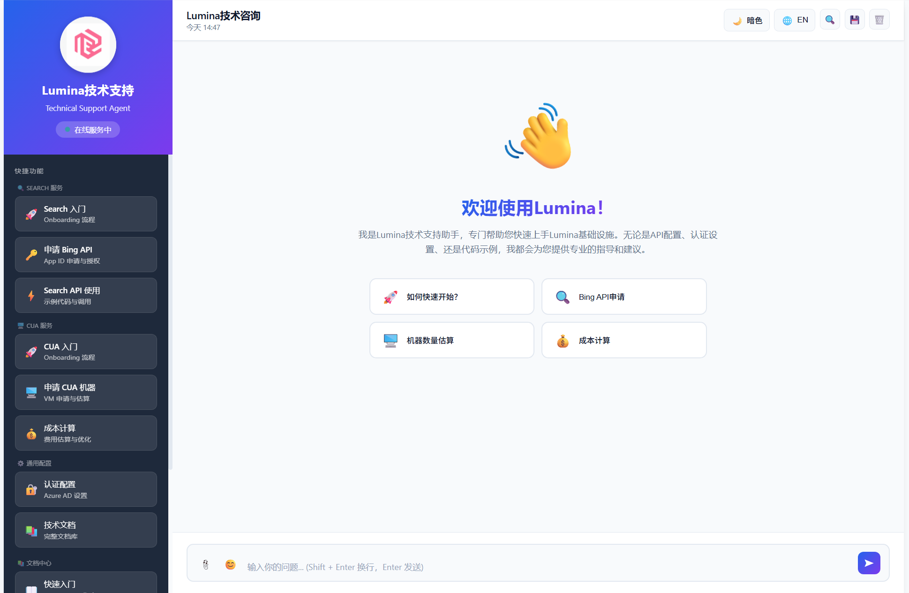
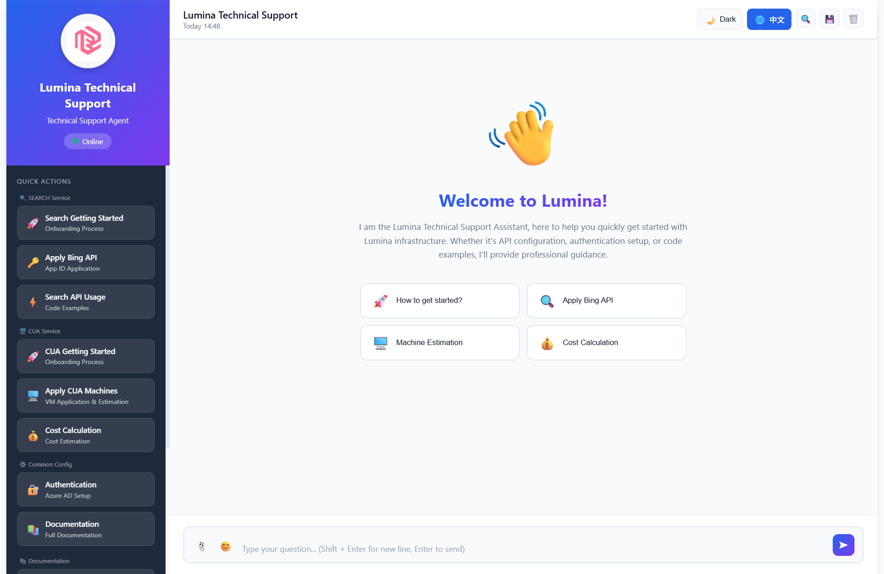
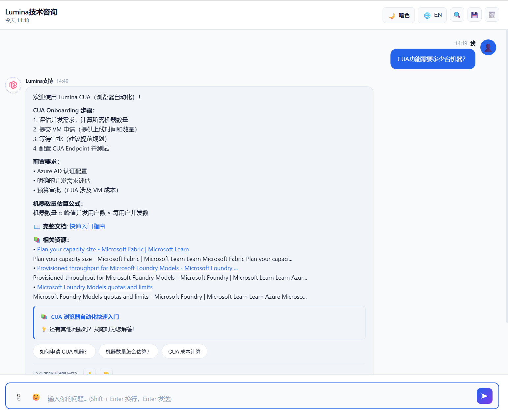
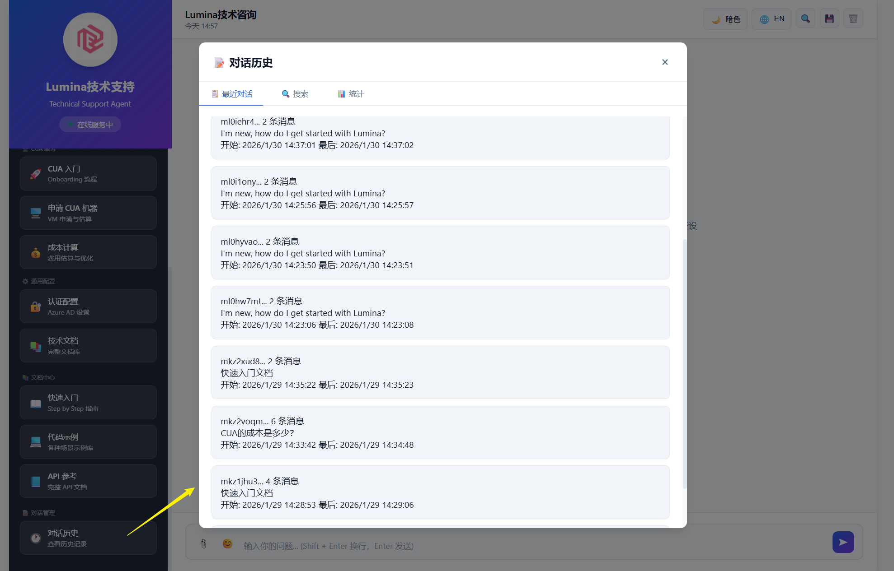
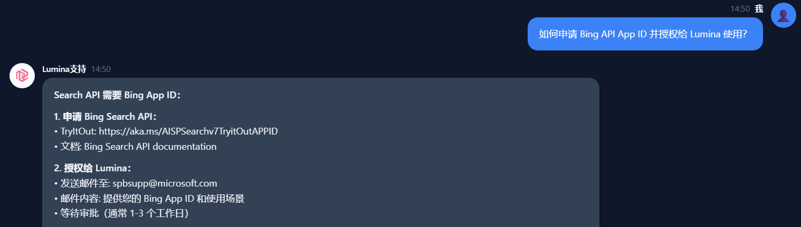
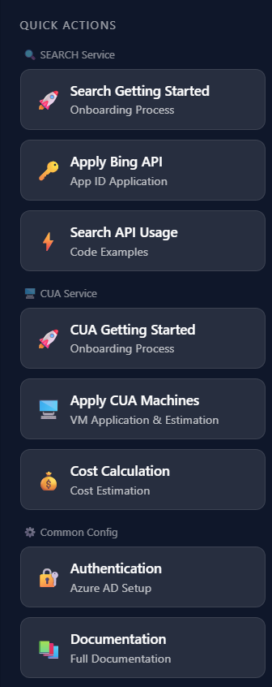
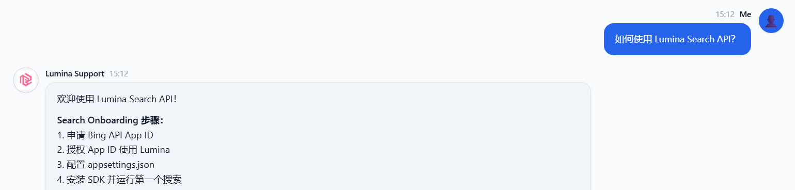
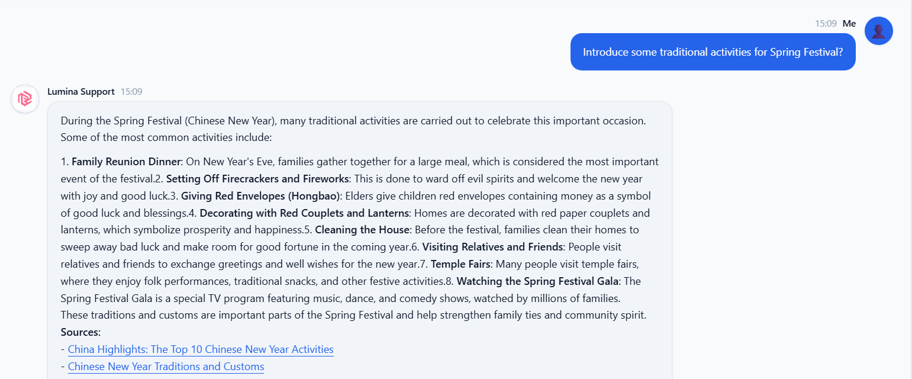

# Lumina API Demo - 智能客服助手

[English](#english-version) | [中文](#中文版本)

---

## 中文版本

### 项目简介

**Customer Service Agent** 是一个基于 Microsoft Lumina API 的智能客服助手，专为解决用户在使用 Lumina 服务时遇到的各类问题而设计。

本项目主要用于回答客户的常见问题，同时集成了强大的联网搜索功能，能够帮助用户解答在 Onboarding 过程中遇到的疑难杂症。通过智能对话 Agent，可以自动化处理重复性的技术支持问题，显著提升团队的工作效率，让技术支持人员将更多精力投入到复杂问题的解决上。

**核心价值:**
- ⚡ **效率提升**: 自动回答重复性问题，减少人工介入
- 🎯 **精准回答**: 基于知识库和实时搜索，提供准确的技术支持
- 📚 **知识沉淀**: 持续学习用户问题，不断扩充知识库
- 🌐 **全天候服务**: 24/7 随时响应用户咨询
- 🔄 **无缝集成**: 与 Lumina Search API 和 CUA API 深度整合

### 主要功能

#### 1. 智能对话系统



**核心能力:**
- 🤖 智能对话: 基于 GPT-4 的自然语言理解
- 📚 知识库系统: 15+ 预设知识条目,涵盖 Search API、CUA API 和通用配置
- 🔍 智能路由: 自动识别用户意图,匹配最相关的知识条目
- 🌐 网络搜索: 集成 Bing Search API,实时查询最新信息
- 💾 对话记忆: 持久化存储对话历史,支持上下文理解
- 🌍 多语言支持: 完整的中英文界面切换



#### 2. 知识库系统


**知识库覆盖范围:**

| 类别 | 内容 |
|------|------|
| **Search 服务** | Search API 入门、Bing API 申请、最佳实践 |
| **CUA 服务** | CUA 机器申请、截图最佳实践、API 使用指南 |
| **通用配置** | 认证配置、SDK 安装、Partner Context 配置 |
| **文档中心** | 快速入门指南、代码示例、API 参考文档 |

**智能匹配功能:**
- **场景识别**: 自动判断用户是否询问 Lumina 相关问题
- **关键词匹配**: 支持中英文关键词智能匹配
- **快速回复**: 预设常见问题的快速回复选项
- **反馈系统**: 用户可对回答质量进行评价(👍/👎)



#### 3. 对话历史管理

**功能特性:**
- 📝 持久化存储: 所有对话自动保存到本地 JSON 文件
- 🔍 历史查询: 按关键词搜索历史对话
- 📊 统计分析: 对话总数、消息计数、来源统计
- 🗑️ 数据清理: 自动清理超过 30 天的旧记录



#### 4. Memory 功能(知识积累)

**智能学习:**
- 🧠 自动学习: 将新的用户问答保存为知识条目
- 📋 待审核队列: 新增知识需要人工审核后生效
- 🏷️ 自动分类: AI 自动为问答分配类别和场景
- 🔄 持续优化: 知识库随使用不断丰富

### 界面特点

#### 现代化设计

- **响应式布局**: 自适应不同屏幕尺寸
- **深色/浅色模式**: 支持主题切换,保护视力
- **流畅动画**: 优雅的交互体验
- **Markdown 支持**: 富文本格式化显示



#### 用户友好

- **侧边栏导航**: 快速访问不同服务类别的知识条目
- **智能搜索**: 输入关键词自动匹配相关知识
- **快速回复按钮**: 一键发送常见问题
- **反馈机制**: 对每个回答进行评价,持续改进



### 技术特点

#### 前端技术
- 原生 HTML/CSS/JavaScript,无框架依赖
- 响应式设计,支持各种屏幕尺寸
- Marked.js 实现 Markdown 渲染
- CSS 变量实现主题切换
- 国际化 (i18n) 支持

#### 后端技术
- ASP.NET Core 8.0 Minimal API
- Azure AD 认证
- Microsoft Lumina API 集成
- Bing Search API 集成
- 本地文件系统持久化(JSON)

#### 架构设计
```
┌─────────────────────────────────────────────────┐
│              Web UI (HTML/CSS/JS)               │
│         customer-service-agent.html             │
├─────────────────────────────────────────────────┤
│          ASP.NET Core Minimal API               │
│              /api/chat/customer-service         │
├─────────────────────────────────────────────────┤
│          CustomerServiceAgent.cs                │
│         • Knowledge Base Management             │
│         • AI Response Generation                │
│         • Web Search Integration                │
├─────────────┬───────────────────┬───────────────┤
│   Memory    │   Conversation    │   Partner     │
│   Service   │   History         │   Context     │
├─────────────┴───────────────────┴───────────────┤
│         Lumina API / Bing Search API            │
└─────────────────────────────────────────────────┘
```

### 快速开始

#### 1. 配置文件

参考主 [README.md](README.md) 完成基础环境配置

#### 2. 运行项目

```bash
# 构建项目
dotnet build

# 运行项目
dotnet run
```

#### 3. 访问界面

打开浏览器访问: http://localhost:8400/customer-service-agent.html


### 项目结构

```
Lumina-API-Demo/
├── CustomerServiceAgent.cs          # 智能客服助手核心逻辑
├── ConversationHistoryService.cs    # 对话历史管理
├── MemoryService.cs                 # 知识记忆服务
├── UserProfile.cs                   # 用户状态管理
├── Program.cs                       # 主程序入口
├── wwwroot/
│   ├── customer-service-agent.html  # 客户服务界面
│   └── images/
│       └── lumina.png              # Lumina Logo
├── docs/
│   └── images/                     # README 截图文件夹
└── appsettings.json                # 配置文件
```

### 使用示例

#### 示例 1: 询问 Search API 使用方法

**用户提问:**
```
如何使用 Lumina Search API？
```

**智能客服助手回答:**
```
📚 相关知识: Search API 快速入门

欢迎使用 Lumina Search API！

Search Onboarding 步骤:
1. 申请 Bing API App ID
2. 授权 App ID 使用 Lumina
3. 配置 appsettings.json
4. 安装 SDK 并运行第一个搜索

前置要求:
• Azure AD 认证配置
• Bing Search API App ID
• .NET 6.0+ 或其他支持的语言

下一步: 了解如何申请 Bing API

[快速回复]: 申请 Bing API | 代码示例 | API 参考
```




#### 示例 2: 非 Lumina 相关问题 - 自动网络搜索

**用户提问:**
```
Introduce some traditional activities for Spring Festival?
```

**智能客服助手回答:**

During the Spring Festival (Chinese New Year), many traditional activities are carried out to celebrate this important occasion. Some of the most common activities include:

1. Family Reunion Dinner: On New Year's Eve, families gather together for a large meal, which is considered the most important event of the festival.2. Setting Off Firecrackers and Fireworks: This is done to ward off evil spirits and welcome the new year with joy and good luck.3. Giving Red Envelopes (Hongbao): Elders give children red envelopes containing money as a symbol of good luck and blessings.4. Decorating with Red Couplets and Lanterns: Homes are decorated with red paper couplets and lanterns, which symbolize prosperity and happiness.5. Cleaning the House: Before the festival, families clean their homes to sweep away bad luck and make room for good fortune in the coming year.6. Visiting Relatives and Friends: People visit relatives and friends to exchange greetings and well wishes for the new year.7. Temple Fairs: Many people visit temple fairs, where they enjoy folk performances, traditional snacks, and other festive activities.8. Watching the Spring Festival Gala: The Spring Festival Gala is a special TV program featuring music, dance, and comedy shows, watched by millions of families.
These traditions and customs are important parts of the Spring Festival and help strengthen family ties and community spirit.
Sources:
- China Highlights: The Top 10 Chinese New Year Activities
- Chinese New Year Traditions and Customs

```


### 核心文件说明

| 文件 | 功能描述 | 关键方法 |
|------|----------|----------|
| `CustomerServiceAgent.cs` | 智能客服助手核心逻辑 | `InitializeKnowledgeBase()` - 初始化知识库<br>`FindKnowledgeMatch()` - 匹配知识条目<br>`GetAIResponseAsync()` - 生成 AI 回答<br>`IsLuminaRelatedAsync()` - 判断问题相关性 |
| `ConversationHistoryService.cs` | 对话历史管理 | `AddEntry()` - 添加对话记录<br>`GetConversationHistory()` - 获取历史<br>`SearchHistory()` - 搜索历史 |
| `MemoryService.cs` | 知识记忆服务 | `SaveMemory()` - 保存新知识<br>`FindSimilarMemories()` - 查找相似记忆<br>`GetPendingApprovals()` - 获取待审核知识 |
| `UserProfile.cs` | 用户状态管理 | 对话状态追踪<br>场景上下文管理 |

### Partner Context 配置

Partner Context 用于追踪和优化 API 使用情况:

```json
{
  "PartnerContext": {
    "Partner": "PM playground",        // 团队名称
    "ScenarioGroup": "APIDemo",        // 场景组
    "ScenarioName": "CustomerService", // 具体场景
    "Application": "Demo",             // 应用名称
    "Component": "ChatAgent"           // 组件名称
  }
}
```

这些配置会在每次 API 调用时发送到 Lumina,帮助团队了解 API 使用模式和优化方向。

### 知识库管理

#### 知识条目结构

每个知识条目包含:
- **Title**: 知识标题
- **Scenario**: 场景分类 (Search/CUA/General)
- **Content**: 详细内容 (支持 Markdown)
- **Keywords**: 关键词数组 (中英文)
- **QuickReplies**: 快速回复选项

#### 添加新知识

1. 编辑 `CustomerServiceAgent.cs`
2. 在 `InitializeKnowledgeBase()` 方法中添加新条目
3. 或通过 Memory 功能自动学习新知识

### 贡献指南

欢迎提交 Issue 和 Pull Request!

### 许可证

MIT License

---

## English Version

### Project Overview

**Customer Service Agent** is an intelligent customer service assistant built on Microsoft Lumina API, designed to address various issues users encounter while using Lumina services.

This project primarily answers common customer questions and integrates powerful web search capabilities to help users resolve complex issues during the Onboarding process. Through the intelligent conversational Agent, it automates repetitive technical support tasks, significantly improving team efficiency and allowing technical support staff to focus on solving more complex problems.

**Core Value:**
- ⚡ **Efficiency Boost**: Automatically answers repetitive questions, reducing manual intervention
- 🎯 **Accurate Answers**: Provides precise technical support based on knowledge base and real-time search
- 📚 **Knowledge Accumulation**: Continuously learns from user questions and expands the knowledge base
- 🌐 **24/7 Service**: Available around the clock to respond to user inquiries
- 🔄 **Seamless Integration**: Deeply integrated with Lumina Search API and CUA API

### Key Features

#### 1. Intelligent Conversation System


**Core Capabilities:**
- 🤖 Smart Conversation: Natural language understanding powered by GPT-4
- 📚 Knowledge Base: 15+ preset knowledge entries covering Search API, CUA API, and general configuration
- 🔍 Smart Routing: Automatically identifies user intent and matches the most relevant knowledge entries
- 🌐 Web Search: Integrated with Bing Search API for real-time information queries
- 💾 Conversation Memory: Persistent storage of conversation history with context understanding
- 🌍 Multilingual Support: Complete Chinese-English interface switching


#### 2. Knowledge Base System


**Knowledge Base Coverage:**

| Category | Content |
|----------|---------|
| **Search Service** | Search API Getting Started, Bing API Application, Best Practices |
| **CUA Service** | CUA Machine Application, Screenshot Best Practices, API Usage Guide |
| **General Config** | Authentication Setup, SDK Installation, Partner Context Configuration |
| **Doc Center** | Quick Start Guide, Code Samples, API Reference |

**Smart Matching Features:**
- **Scenario Recognition**: Automatically determines if the user is asking Lumina-related questions
- **Keyword Matching**: Supports intelligent matching of Chinese and English keywords
- **Quick Replies**: Preset quick reply options for common questions
- **Feedback System**: Users can rate answer quality (👍/👎)


#### 3. Conversation History Management

**Features:**
- 📝 Persistent Storage: All conversations automatically saved to local JSON files
- 🔍 History Query: Search historical conversations by keywords
- 📊 Statistical Analysis: Total conversations, message counts, source statistics
- 🗑️ Data Cleanup: Automatic cleanup of records older than 30 days


#### 4. Memory Feature (Knowledge Accumulation)

**Intelligent Learning:**
- 🧠 Auto Learning: Save new user Q&A as knowledge entries
- 📋 Review Queue: New knowledge requires manual review before activation
- 🏷️ Auto Categorization: AI automatically assigns categories and scenarios to Q&A
- 🔄 Continuous Optimization: Knowledge base continuously enriched with usage

### Interface Features

#### Modern Design

- **Responsive Layout**: Adaptive to different screen sizes
- **Dark/Light Mode**: Theme switching to protect eyesight
- **Smooth Animations**: Elegant interaction experience
- **Markdown Support**: Rich text formatted display


#### User-Friendly

- **Sidebar Navigation**: Quick access to knowledge entries in different service categories
- **Smart Search**: Automatic matching of relevant knowledge by entering keywords
- **Quick Reply Buttons**: One-click sending of common questions
- **Feedback Mechanism**: Rate each answer for continuous improvement


### Technical Features

#### Frontend Technologies
- Native HTML/CSS/JavaScript, no framework dependencies
- Responsive design, supports various screen sizes
- Marked.js for Markdown rendering
- CSS variables for theme switching
- Internationalization (i18n) support

#### Backend Technologies
- ASP.NET Core 8.0 Minimal API
- Azure AD Authentication
- Microsoft Lumina API Integration
- Bing Search API Integration
- Local file system persistence (JSON)

#### Architecture Design
```
┌─────────────────────────────────────────────────┐
│              Web UI (HTML/CSS/JS)               │
│         customer-service-agent.html             │
├─────────────────────────────────────────────────┤
│          ASP.NET Core Minimal API               │
│              /api/chat/customer-service         │
├─────────────────────────────────────────────────┤
│          CustomerServiceAgent.cs                │
│         • Knowledge Base Management             │
│         • AI Response Generation                │
│         • Web Search Integration                │
├─────────────┬───────────────────┬───────────────┤
│   Memory    │   Conversation    │   Partner     │
│   Service   │   History         │   Context     │
├─────────────┴───────────────────┴───────────────┤
│         Lumina API / Bing Search API            │
└─────────────────────────────────────────────────┘
```

### Quick Start

#### 1. Configuration

Refer to main [README.md](README.md) for basic environment setup

#### 2. Run Project

```bash
# Build project
dotnet build

# Run project
dotnet run
```

#### 3. Access Interface

Open browser and visit: http://localhost:8400/customer-service-agent.html


### Project Structure

```
Lumina-API-Demo/
├── CustomerServiceAgent.cs          # Customer Service Agent core logic
├── ConversationHistoryService.cs    # Conversation history management
├── MemoryService.cs                 # Knowledge memory service
├── UserProfile.cs                   # User state management
├── Program.cs                       # Main program entry
├── wwwroot/
│   ├── customer-service-agent.html  # Customer service interface
│   └── images/
│       └── lumina.png              # Lumina Logo
├── docs/
│   └── images/                     # README screenshot folder
└── appsettings.json                # Configuration file
```

### Usage Examples

#### Example 1: Inquiring about Search API Usage

**User Question:**
```
How to use Lumina Search API?
```

**Customer Service Agent Response:**
```
📚 Related Knowledge: Search API Quick Start

Welcome to Lumina Search API!

Search Onboarding Steps:
1. Apply for Bing API App ID
2. Authorize App ID to use Lumina
3. Configure appsettings.json
4. Install SDK and run your first search

Prerequisites:
• Azure AD authentication configuration
• Bing Search API App ID
• .NET 6.0+ or other supported languages

Next Steps: Learn how to apply for Bing API

[Quick Replies]: Apply for Bing API | Code Samples | API Reference
```


#### Example 2: Inquiring about Authentication Configuration

**User Question:**
```
How to configure Azure AD authentication?
```

**Customer Service Agent Response:**
```
📚 Related Knowledge: Azure AD Authentication Configuration

Lumina API uses Azure AD for authentication.

Configuration Steps:
1. Register application in Azure Portal
2. Get Tenant ID, Client ID, and Client Secret
3. Configure authentication info in appsettings.json
4. Set correct API Scopes

Example Configuration:
{
  "AzureAd": {
    "TenantId": "YOUR_TENANT_ID",
    "ClientId": "YOUR_CLIENT_ID",
    "Audience": "api://YOUR_AUDIENCE"
  }
}

📖 Detailed Documentation: [Quick Start Guide](https://eng.ms/docs/...)

[Quick Replies]: Partner Context Config | SDK Installation | Code Samples
```


#### Example 3: Non-Lumina Related Questions - Automatic Web Search

**User Question:**
```
What is Elon Musk doing recently?
```

**Customer Service Agent Response:**
```
🔍 Searching for latest information...

According to search results:

Elon Musk's recent activities include:

1. **SpaceX**: Continuing Starship rocket testing and development
2. **Tesla**: Releasing new electric vehicles and autonomous driving updates
3. **X (Twitter)**: Continuously improving platform features and policies
4. **Neuralink**: Advancing brain-computer interface clinical trials

💡 Tip: I specialize in Lumina API technical support. If you have
questions about Lumina Search API or CUA API, I can provide more
professional assistance!

[Quick Replies]: Search API Getting Started | CUA Getting Started | Doc Center
```


### Core Files Description

| File | Description | Key Methods |
|------|-------------|-------------|
| `CustomerServiceAgent.cs` | Customer Service Agent core logic | `InitializeKnowledgeBase()` - Initialize knowledge base<br>`FindKnowledgeMatch()` - Match knowledge entries<br>`GetAIResponseAsync()` - Generate AI response<br>`IsLuminaRelatedAsync()` - Determine question relevance |
| `ConversationHistoryService.cs` | Conversation history management | `AddEntry()` - Add conversation record<br>`GetConversationHistory()` - Get history<br>`SearchHistory()` - Search history |
| `MemoryService.cs` | Knowledge memory service | `SaveMemory()` - Save new knowledge<br>`FindSimilarMemories()` - Find similar memories<br>`GetPendingApprovals()` - Get pending knowledge |
| `UserProfile.cs` | User state management | Conversation state tracking<br>Scenario context management |

### Partner Context Configuration

Partner Context is used to track and optimize API usage:

```json
{
  "PartnerContext": {
    "Partner": "PM playground",        // Team name
    "ScenarioGroup": "APIDemo",        // Scenario group
    "ScenarioName": "CustomerService", // Specific scenario
    "Application": "Demo",             // Application name
    "Component": "ChatAgent"           // Component name
  }
}
```

These configurations are sent to Lumina with each API call, helping teams understand API usage patterns and optimization directions.

### Knowledge Base Management

#### Knowledge Entry Structure

Each knowledge entry contains:
- **Title**: Knowledge title
- **Scenario**: Scenario classification (Search/CUA/General)
- **Content**: Detailed content (Markdown supported)
- **Keywords**: Keyword array (Chinese/English)
- **QuickReplies**: Quick reply options

#### Adding New Knowledge

1. Edit `CustomerServiceAgent.cs`
2. Add new entries in `InitializeKnowledgeBase()` method
3. Or automatically learn new knowledge through Memory feature

### Contributing

Issues and Pull Requests are welcome!

### License

MIT License

---

## 📸 Screenshot Checklist

To complete this README, please add the following screenshots to the `docs/images/` folder:

### 必需截图 (Required Screenshots)

- [ ] `customer-service-overview.png` - 智能客服助手主界面 (Customer service agent main interface)
- [ ] `language-switch.png` - 语言切换演示,中英文对比 (Language switching demonstration)
- [ ] `knowledge-base.png` - 知识库侧边栏导航 (Knowledge base sidebar navigation)
- [ ] `qa-example.png` - 智能问答示例含快速回复 (Q&A example with quick replies)
- [ ] `dark-mode.png` - 深色模式界面演示 (Dark mode interface demonstration)
- [ ] `getting-started.png` - 应用启动和主页 (Application startup and home page)
- [ ] `customer-service-features.png` - 客户服务详细功能展示 (Customer service detailed features)

### 可选截图 (Optional Screenshots)

- [ ] `search-api-qa.png` - Search API 具体问答示例 (Search API specific Q&A example)
- [ ] `auth-config-qa.png` - 认证配置问答示例 (Authentication config Q&A example)
- [ ] `web-search-example.png` - 网络搜索功能示例 (Web search feature example)

### 建议的截图内容 (Suggested Screenshot Content)

1. **customer-service-overview.png**: 显示完整的客户服务界面,包括侧边栏、聊天区域、Lumina logo 和欢迎信息
2. **language-switch.png**: 展示点击语言切换按钮前后的对比(左侧中文/右侧英文,或上下对比)
3. **knowledge-base.png**: 突出显示侧边栏中的不同知识类别(Search 服务、CUA 服务、通用配置、文档中心)
4. **qa-example.png**: 展示一个完整的问答流程,包括用户提问、Agent 回答、知识卡片和快速回复按钮
5. **dark-mode.png**: 深色模式下的客户服务界面
6. **getting-started.png**: 应用首次启动时的欢迎界面,显示 Agent 头像、名称和在线状态
7. **customer-service-features.png**: 展示多个功能特性,如侧边栏、对话、反馈按钮等
8. **search-api-qa.png**: 用户询问 "如何使用 Lumina Search API?" 的完整问答
9. **auth-config-qa.png**: 用户询问认证配置的问答示例
10. **web-search-example.png**: 展示非 Lumina 问题时自动调用网络搜索的场景

---

## 🎨 截图规格建议 (Screenshot Specifications)

- **分辨率**: 1920x1080 或 1280x720
- **格式**: PNG (推荐) 或 JPG
- **文件大小**: 尽量控制在 500KB 以内
- **浏览器**: 推荐使用 Chrome 或 Edge 进行截图
- **缩放比例**: 100% (避免界面模糊)
- **窗口大小**: 全屏或固定尺寸,保持一致性

---

创建完截图后,将所有图片文件放入 `docs/images/` 文件夹即可。README 会自动显示这些图片。
