# 📓 Lumina API Demo - Notebook 功能展示

<p align="center">
  <strong>🤖 AI 驱动的智能研究助手 | AI-Powered Research Assistant</strong>
</p>

<p align="center">
  <code>RAG 对话</code> · <code>智能搜索</code> · <code>思维导图</code> · <code>信息图生成</code> · <code>学习指南</code>
</p>

<p align="center">
  <a href="#中文版本">🇨🇳 中文</a> · <a href="#english-version">🇺🇸 English</a>
</p>

---

## 中文版本

### 📖 项目简介

Lumina API Demo 的 Notebook 功能是一个类似 **Google NotebookLM** 的 AI 研究助手，专为**学习与研究**场景设计。它能帮助你：

- 📚 **整合多源信息** - 将文章、网页、文档等资料汇集到一个工作空间
- 🤖 **与资料对话** - AI 基于你的资料进行深度问答，提供有引用的准确回答  
- ✨ **自动生成内容** - 一键生成学习指南、摘要、FAQ、思维导图、信息图等多种形式

> 💡 **设计理念**: 让 AI 成为你的研究伙伴，帮助你更快地理解、整理和分享知识。

---

### ⚡ 核心亮点

<table>
  <tr>
    <td align="center" width="25%">
      <h3>📚</h3>
      <b>高效整合</b><br/>
      <sub>一键添加文本、网页、文件或搜索结果作为知识来源</sub>
    </td>
    <td align="center" width="25%">
      <h3>🎯</h3>
      <b>智能对话</b><br/>
      <sub>基于 RAG 技术，AI 准确引用你的资料回答问题</sub>
    </td>
    <td align="center" width="25%">
      <h3>🎨</h3>
      <b>多样生成</b><br/>
      <sub>支持学习指南、摘要、FAQ、思维导图、信息图等</sub>
    </td>
    <td align="center" width="25%">
      <h3>🔍</h3>
      <b>Lumina Search</b><br/>
      <sub>调用 <b>Lumina Search API</b>，AI 结合实时网络信息回答</sub>
    </td>
  </tr>
</table>

---

### 🎯 使用场景

<table>
  <tr>
    <td width="33%">
      <h4>🎓 学术研究</h4>
      <p>收集多篇论文和资料，让 AI 帮你理清研究脉络，自动生成文献综述和研究要点。</p>
      <code>适合：研究生、学者、分析师</code>
    </td>
    <td width="33%">
      <h4>💼 会议纪要</h4>
      <p>将会议记录、邮件和文档汇总，快速生成行动要点、决策摘要和待办事项。</p>
      <code>适合：项目经理、团队 Lead、秘书</code>
    </td>
    <td width="33%">
      <h4>📖 备考复习</h4>
      <p>导入课程讲义和教材，AI 自动生成学习指南、FAQ 和练习题，助你高效备考。</p>
      <code>适合：学生、考证备考者、培训学员</code>
    </td>
  </tr>
</table>

---

### 🖼️ 功能截图

#### 首页 - 笔记本管理
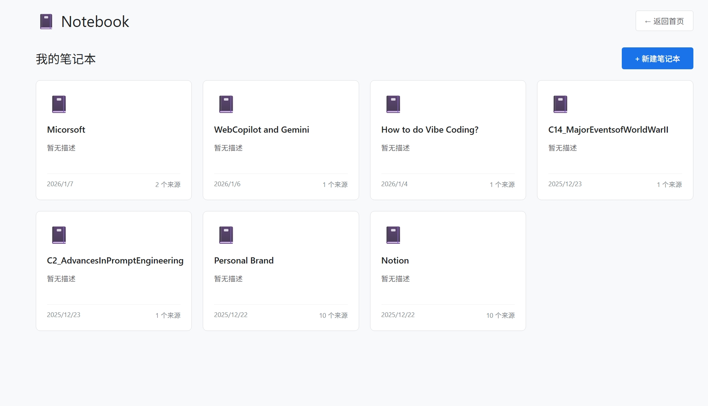

管理你的所有笔记本，支持创建、编辑、删除操作。

#### 创建笔记本
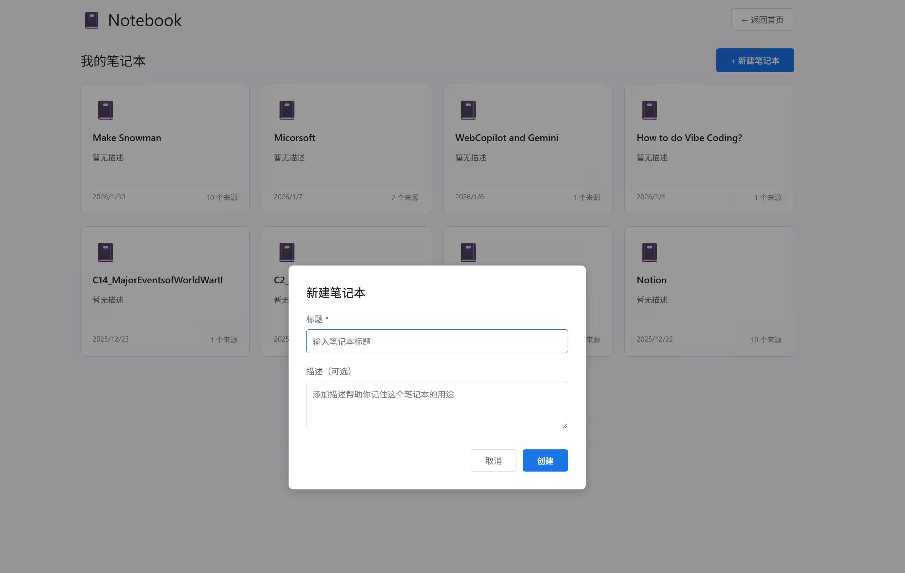

为每个项目或主题创建独立的笔记本空间。

#### 笔记本工作区
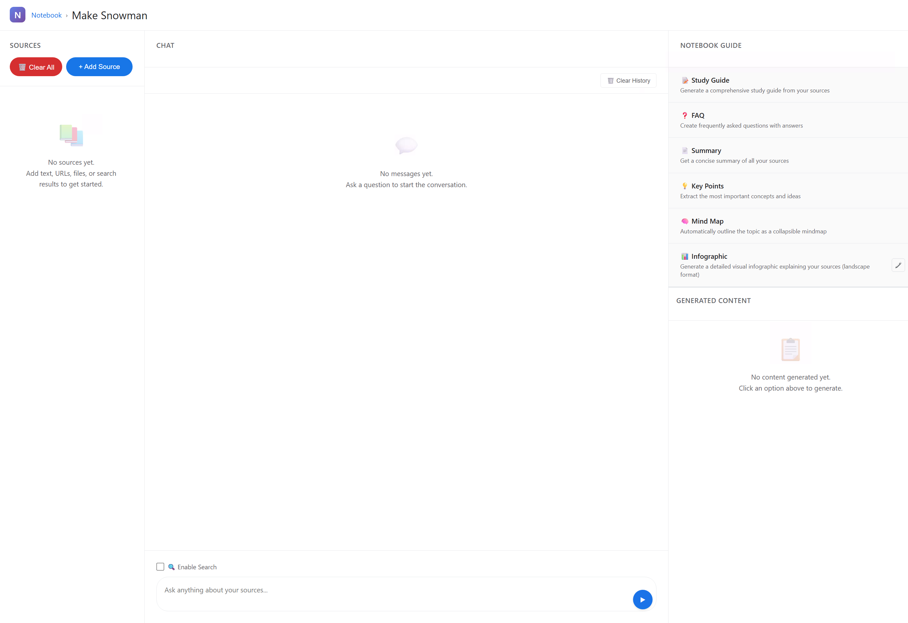

三栏式布局：左侧来源管理 | 中间智能对话 | 右侧创意生成

#### 添加来源
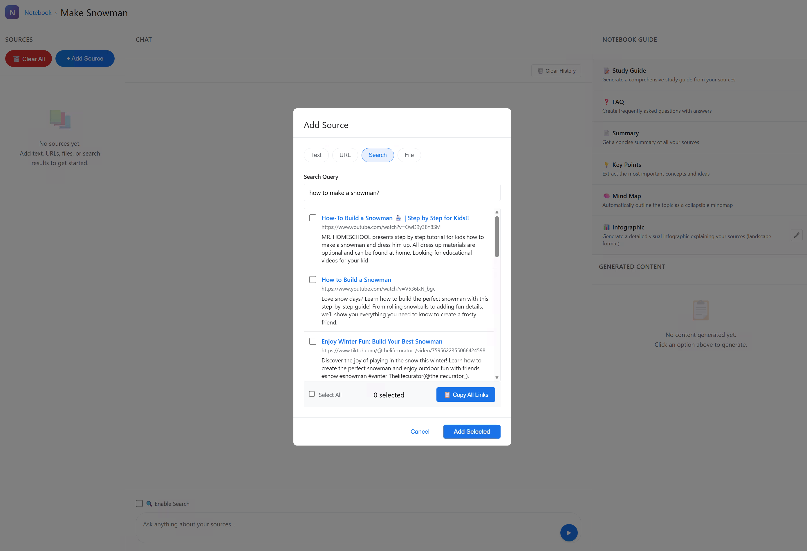

支持多种来源类型：
- 📝 直接输入文本
- 🔗 粘贴网页链接（自动抓取内容）
- 📁 上传文件（.txt / .md）
- 🔍 网络搜索（自动获取相关内容）

#### 智能对话
<table>
  <tr>
    <th align="center" width="50%">RAG 对话模式</th>
    <th align="center" width="50%">Lumina Search 增强模式</th>
  </tr>
  <tr>
    <td align="center">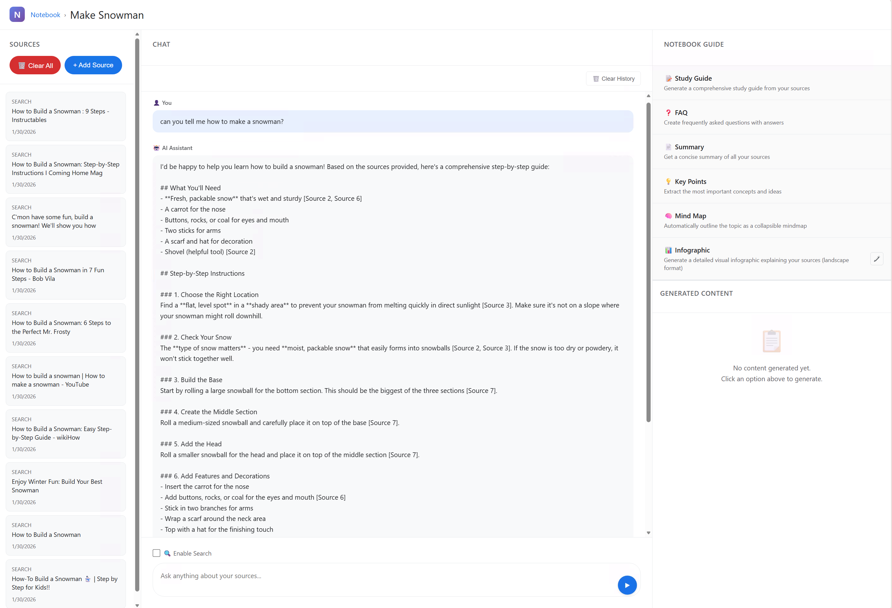</td>
    <td align="center">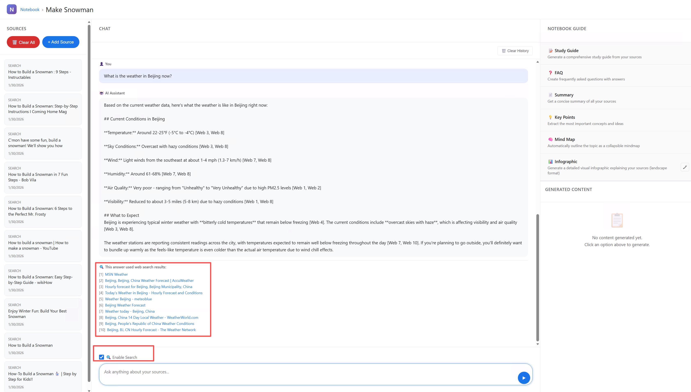</td>
  </tr>
  <tr>
    <td align="center">AI 基于你的资料进行回答，并标注引用来源</td>
    <td align="center">调用 <b>Lumina Search API</b>，AI 结合实时网络搜索获取更完整的回答</td>
  </tr>
</table>

> 💡 **提示**: 开启 Search 模式后，AI 通过 **Lumina Search API** 实时搜索网络，不仅能引用你的资料，还能补充最新信息！

---

### 🎨 内容生成

系统支持多种内容生成形式，帮助你以不同方式理解和展示知识：

| 生成类型 | 说明 | 适用场景 |
|---------|------|---------|
| 📖 **学习指南** (Study Guide) | 系统化的学习材料，包含章节、要点和练习 | 备考复习、课程学习 |
| 📋 **摘要** (Summary) | 精炼的内容概述，抓住核心信息 | 快速了解、汇报准备 |
| ❓ **FAQ** | 自动生成常见问题与解答 | 知识梳理、答疑准备 |
| 🎯 **要点提取** (Key Points) | 提炼关键信息，条目清晰 | 会议纪要、重点回顾 |
| 🧠 **思维导图** (Mindmap) | 可视化知识结构和关联 | 头脑风暴、知识整理 |
| 🎨 **信息图** (Infographic) | 精美的视觉化信息展示 | 演示汇报、社交分享 |

---

#### 🧠 思维导图生成
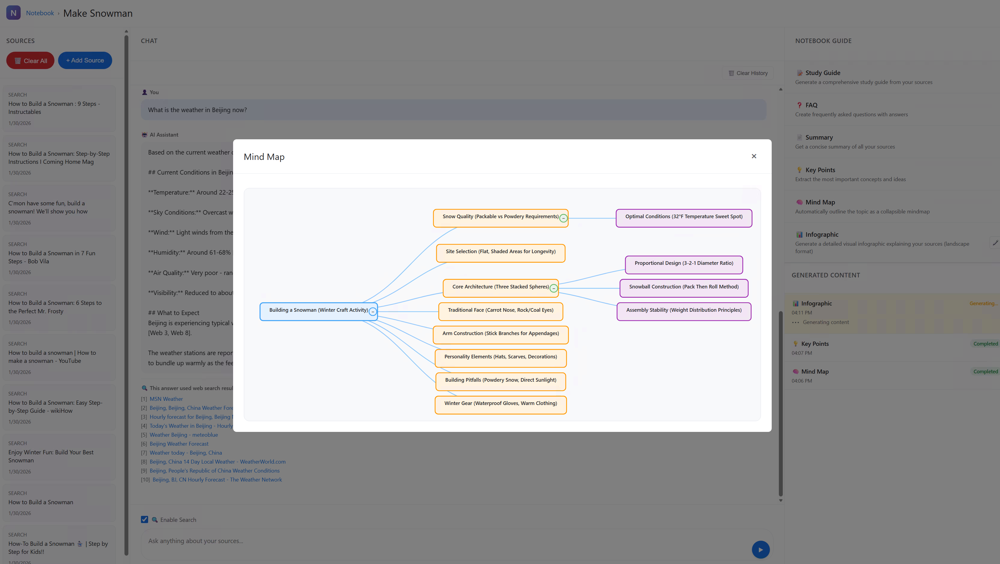

一键将笔记本内容转化为结构清晰的思维导图，帮助你：
- 📊 可视化知识结构
- 🔗 发现内容关联
- 📝 快速总结要点

#### 🎨 信息图生成（重点功能）
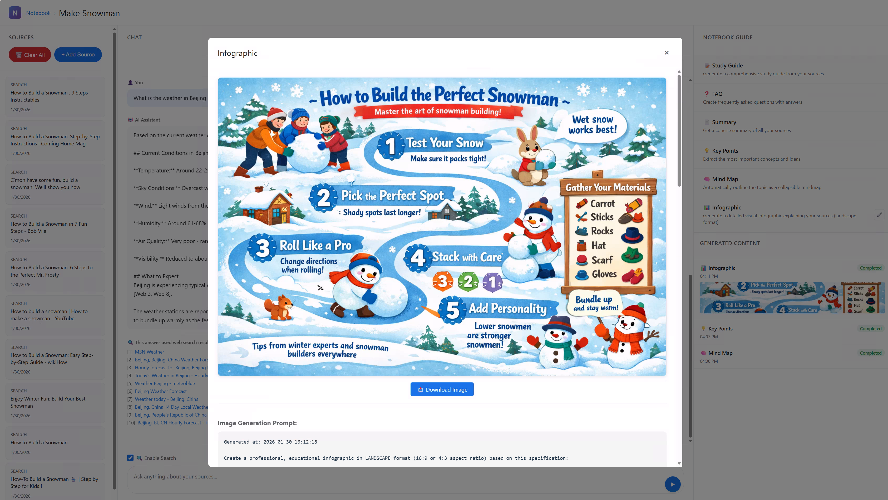

AI 自动分析内容，智能选择最匹配的视觉风格，生成专业的信息图。

**智能风格检测** - 系统支持 8 大领域、27 种变体风格：

| 领域 | 风格变体 | 适用场景 |
|------|---------|---------|
| 🏢 商业 | 编辑风、数据简约、企业风 | 战略分析、市场报告 |
| 📜 历史 | 经典时间线、纪录片风、文化传承 | 历史事件、人物传记 |
| 🔬 科学 | 学术论文、实验视觉、科学插画 | 研究成果、实验报告 |
| 🌌 自然太空 | 宇宙奇观、自然极简、户外探险 | 天文科普、自然探索 |
| 💻 技术 | 赛博朋克、等距图、数据仪表板 | 技术架构、产品说明 |
| 🧘 生活方式 | 禅意极简、活力生活、编辑生活 | 健康养生、生活技巧 |
| 📱 社交 | Pinterest拼贴、Instagram现代、网红风 | 社交媒体、品牌推广 |
| 👨‍👩‍👧‍👦 家庭 | 趣味学习、教育故事、插画冒险 | 儿童教育、亲子活动 |

**✨ 自定义风格** - 除了自动检测，你还可以自定义信息图风格：

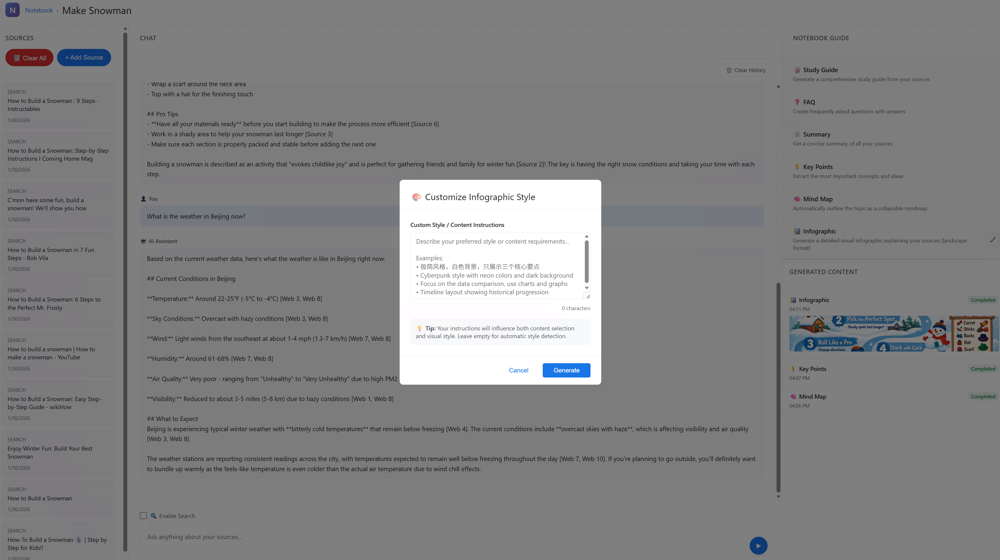

通过自定义提示词，你可以：
- 🎨 指定特定的视觉风格（如“扁平化设计”、“手绘插画风”）
- 🎨 设定配色方案（如“使用暖色调”、“简约黑白风”）
- 📝 强调特定内容或布局要求

---

### 🌟 信息图作品展示

以下是 AI 自动生成的信息图示例，展示了不同领域和风格的实际效果：

<table>
  <tr>
    <td align="center">
      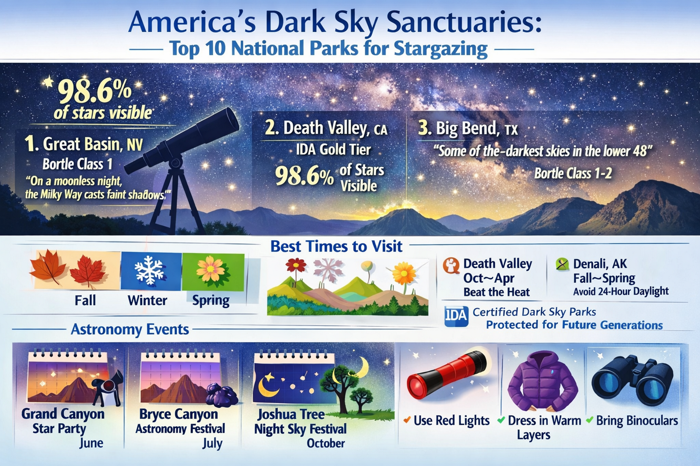<br/>
      <b>🌌 天文科普</b><br/>
      <sub>风格: 宇宙奇观 · 自然太空</sub>
    </td>
    <td align="center">
      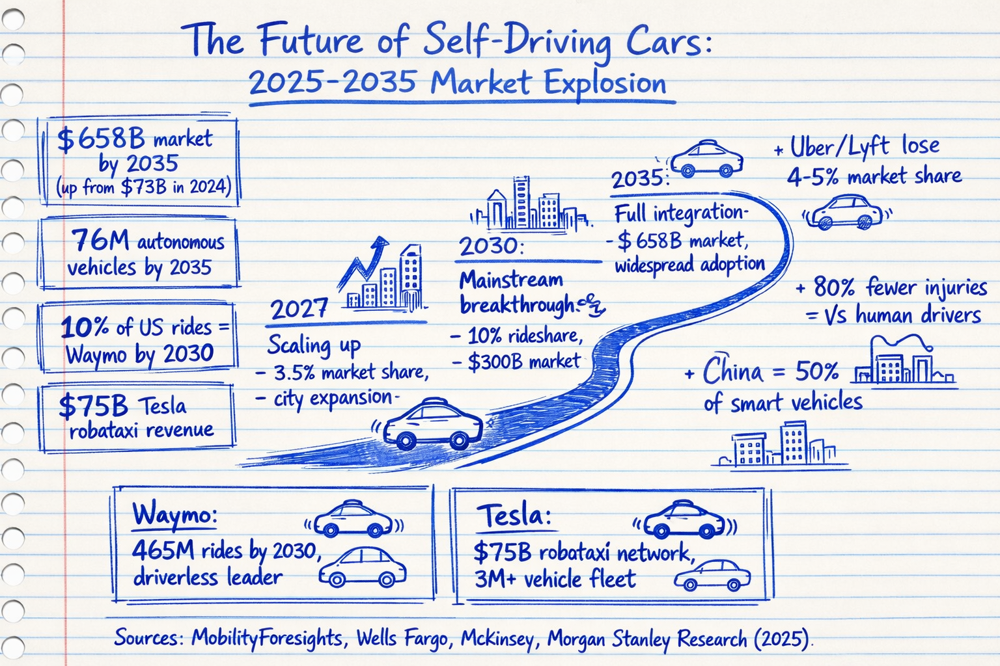<br/>
      <b>💼 商业分析</b><br/>
      <sub>风格: 数据简约 · 商业</sub>
    </td>
  </tr>
  <tr>
    <td align="center">
      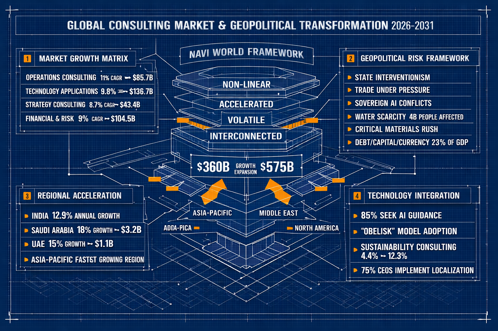<br/>
      <b>🔬 科学研究</b><br/>
      <sub>风格: 学术论文 · 科学</sub>
    </td>
    <td align="center">
      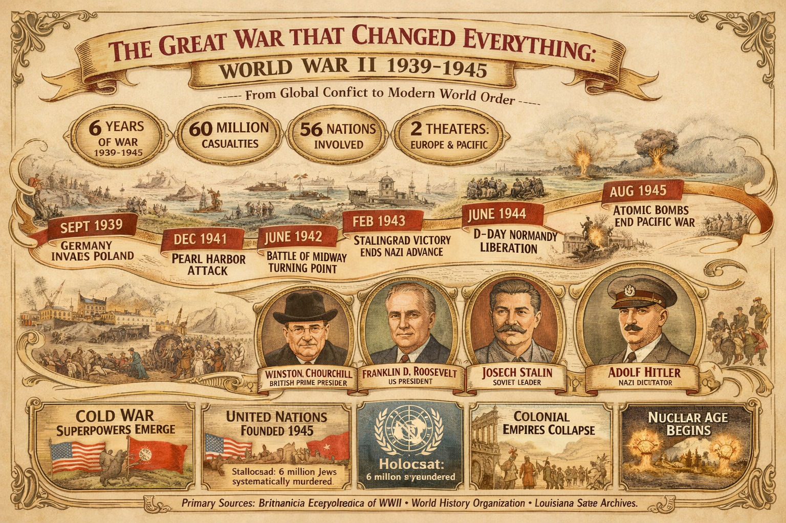<br/>
      <b>📚 教育学习</b><br/>
      <sub>风格: 趣味学习 · 家庭</sub>
    </td>
  </tr>
</table>

> 💡 **提示**: AI 会根据内容自动检测最合适的风格，你也可以通过自定义提示词完全控制生成风格！

---

### 🚀 快速开始

1. **启动服务**
   ```powershell
   cd Lumina-API-Demo
   dotnet run
   ```

2. **打开应用** - 访问 http://localhost:8400/notebook/

3. **创建笔记本** - 点击 "New Notebook" 创建你的第一个笔记本

4. **添加来源** - 添加文本、链接或上传文件

5. **开始对话** - 与 AI 讨论你的内容，或生成思维导图/信息图

---

### 📁 数据结构

```
notebooks/Data/
├── index.json                    # 笔记本索引
└── {notebook-id}/
    ├── metadata.json             # 笔记本元数据
    ├── sources.json              # 所有来源内容
    ├── chat-history.json         # 对话历史
    ├── generations.json          # 生成记录
    └── images/                   # 生成的图片
```

---

### 🔧 技术架构

```
┌─────────────────┐     ┌──────────────────┐     ┌─────────────────┐
│                 │     │                  │     │                 │
│   浏览器 UI     │────▶│   C# 后端        │────▶│  egress-llm     │
│   (HTML/JS)     │◀────│   (ASP.NET)      │◀────│  (AI 服务)      │
│                 │     │                  │     │                 │
└─────────────────┘     └──────────────────┘     └─────────────────┘
                                 │
                                 │ 调用 Python 技能
                                 ▼
                        ┌──────────────────┐
                        │ infographic-gen  │
                        │ (信息图生成技能) │
                        └──────────────────┘
```

> 📌 **说明**: 目前系统集成了一个 Python 技能 `infographic-gen`，用于生成专业信息图。其他内容（学习指南、摘要、FAQ、思维导图等）由 C# 后端直接调用 LLM 生成。

---

### ❓ 常见问题 (FAQ)

<details>
<summary><b>📝 支持哪些来源格式？</b></summary>

- **文本**: 直接粘贴任何文本内容
- **网页**: 粘贴 URL，系统自动抓取内容
- **文件**: 支持 .txt 和 .md 文件上传
- **搜索**: 输入关键词，系统自动搜索并添加相关结果
</details>

<details>
<summary><b>🤖 RAG 对话和 Search 模式有什么区别？</b></summary>

- **RAG 模式**: AI 仅基于你添加的来源进行回答，回答更准确、可追溯
- **Search 模式**: 调用 **Lumina Search API** 实时搜索网络获取最新信息，适合需要实时数据的场景
</details>

<details>
<summary><b>🎨 信息图风格是如何选择的？</b></summary>

AI 会自动分析你的内容，通过关键词检测选择最匹配的领域和风格。例如：
- 包含“星球、太空、宇宙”→ 自动选择“自然太空”风格
- 包含“商业、战略、营收”→ 自动选择“商业”风格
</details>

<details>
<summary><b>💾 数据存储在哪里？</b></summary>

所有数据存储在 `notebooks/Data/` 文件夹中，以 JSON 格式保存。重启服务后数据仍然保留。
</details>

<details>
<summary><b>⏱️ 信息图生成需要多久？</b></summary>

通常需要 30-90 秒，取决于内容复杂度和网络情况。生成过程包括内容分析、风格选择和图像渲染三个步骤。
</details>

---

## English Version

### 📖 Overview

The Notebook feature in Lumina API Demo is an AI research assistant similar to **Google NotebookLM**, designed specifically for **learning and research**. It helps you:

- 📚 **Consolidate Information** - Gather articles, web pages, and documents into one workspace
- 🤖 **Chat with Your Sources** - AI provides accurate, cited answers based on your materials
- ✨ **Auto-Generate Content** - Create study guides, summaries, FAQs, mindmaps, infographics and more with one click

> 💡 **Design Philosophy**: Make AI your research partner to help you understand, organize, and share knowledge faster.

---

### ⚡ Key Features

<table>
  <tr>
    <td align="center" width="25%">
      <h3>📚</h3>
      <b>Efficient Integration</b><br/>
      <sub>One-click to add text, URLs, files, or search results as knowledge sources</sub>
    </td>
    <td align="center" width="25%">
      <h3>🎯</h3>
      <b>Smart Conversation</b><br/>
      <sub>RAG-powered AI accurately references your materials to answer questions</sub>
    </td>
    <td align="center" width="25%">
      <h3>🎨</h3>
      <b>Diverse Generation</b><br/>
      <sub>Supports study guides, summaries, FAQs, mindmaps, infographics and more</sub>
    </td>
    <td align="center" width="25%">
      <h3>🔍</h3>
      <b>Lumina Search</b><br/>
      <sub>Powered by <b>Lumina Search API</b> for real-time web information</sub>
    </td>
  </tr>
</table>

---

### 🎯 Use Cases

<table>
  <tr>
    <td width="33%">
      <h4>🎓 Academic Research</h4>
      <p>Collect papers and materials, let AI help you clarify research context, auto-generate literature reviews and key findings.</p>
      <code>For: Researchers, Scholars, Analysts</code>
    </td>
    <td width="33%">
      <h4>💼 Meeting Notes</h4>
      <p>Consolidate meeting recordings, emails and documents, quickly generate action items, decision summaries and to-dos.</p>
      <code>For: Project Managers, Team Leads, Assistants</code>
    </td>
    <td width="33%">
      <h4>📖 Exam Preparation</h4>
      <p>Import course lectures and textbooks, AI auto-generates study guides, FAQs and practice questions for efficient studying.</p>
      <code>For: Students, Certification Candidates, Trainees</code>
    </td>
  </tr>
</table>

---

### 🖼️ Feature Screenshots

#### Home - Notebook Management


Manage all your notebooks with support for create, edit, and delete operations.

#### Create Notebook


Create a dedicated notebook space for each project or topic.

#### Notebook Workspace


Three-panel layout: Sources (left) | Chat (center) | Studio (right)

#### Add Sources


Multiple source types supported:
- 📝 Direct text input
- 🔗 Paste URL (auto-fetches content)
- 📁 Upload files (.txt / .md)
- 🔍 Web search (auto-retrieves relevant content)

#### Smart Chat
<table>
  <tr>
    <th align="center" width="50%">RAG Chat Mode</th>
    <th align="center" width="50%">Lumina Search Enhanced Mode</th>
  </tr>
  <tr>
    <td align="center"></td>
    <td align="center"></td>
  </tr>
  <tr>
    <td align="center">AI answers based on your sources with citations</td>
    <td align="center">Powered by <b>Lumina Search API</b> for real-time web search results</td>
  </tr>
</table>

> 💡 **Tip**: With Search mode enabled, AI uses **Lumina Search API** to search the web in real-time, combining your sources with the latest information!

---

### 🎨 Content Generation

The system supports multiple content generation types to help you understand and present knowledge in different ways:

| Generation Type | Description | Use Cases |
|----------------|-------------|-----------|
| 📖 **Study Guide** | Systematic learning materials with chapters, key points, and exercises | Exam prep, Course study |
| 📋 **Summary** | Concise content overview capturing core information | Quick review, Report prep |
| ❓ **FAQ** | Auto-generated frequently asked questions and answers | Knowledge review, Q&A prep |
| 🎯 **Key Points** | Extracted key information in clear bullet points | Meeting notes, Quick recap |
| 🧠 **Mindmap** | Visualize knowledge structure and relationships | Brainstorming, Knowledge mapping |
| 🎨 **Infographic** | Beautiful visual information display | Presentations, Social sharing |

---

#### 🧠 Mindmap Generation


One-click to transform notebook content into clear, structured mindmaps:
- 📊 Visualize knowledge structure
- 🔗 Discover content connections
- 📝 Quickly summarize key points

#### 🎨 Infographic Generation (Featured)


AI automatically analyzes content, intelligently selects the best visual style, and generates professional infographics.

**Intelligent Style Detection** - System supports 8 domains with 27 style variants:

| Domain | Style Variants | Use Cases |
|--------|---------------|-----------|
| 🏢 Business | Editorial, Minimal-Data, Corporate | Strategy analysis, Market reports |
| 📜 History | Timeline-Classic, Documentary, Cultural-Heritage | Historical events, Biographies |
| 🔬 Science | Academic-Paper, Lab-Visual, Illustrated-Science | Research findings, Experiment reports |
| 🌌 Nature-Space | Cosmic-Wonder, Nature-Minimal, Outdoor-Adventure | Astronomy, Nature exploration |
| 💻 Technology | Cyberpunk, Notion-Isometric, Data-Dashboard | Tech architecture, Product docs |
| 🧘 Lifestyle | Zen-Minimal, Vibrant-Lifestyle, Editorial-Lifestyle | Wellness, Life tips |
| 📱 Social | Pinterest-Collage, Instagram-Modern, Influencer-Bold | Social media, Branding |
| 👨‍👩‍👧‍👦 Family | Playful-Learning, Educational-Story, Illustrated-Adventure | Kids education, Family activities |

**✨ Custom Styles** - Beyond auto-detection, you can also customize the infographic style:


With custom prompts, you can:
- 🎨 Specify a particular visual style (e.g., "flat design", "hand-drawn illustration")
- 🎨 Set color schemes (e.g., "warm tones", "minimalist black and white")
- 📝 Emphasize specific content or layout requirements

---

### 🌟 Infographic Gallery

Here are examples of AI-generated infographics, showcasing different domains and styles:

<table>
  <tr>
    <td align="center">
      <br/>
      <b>🌌 Astronomy</b><br/>
      <sub>Style: Cosmic Wonder · Nature-Space</sub>
    </td>
    <td align="center">
      <br/>
      <b>💼 Business</b><br/>
      <sub>Style: Minimal-Data · Business</sub>
    </td>
  </tr>
  <tr>
    <td align="center">
      <br/>
      <b>🔬 Science</b><br/>
      <sub>Style: Academic-Paper · Science</sub>
    </td>
    <td align="center">
      <br/>
      <b>📚 Education</b><br/>
      <sub>Style: Playful-Learning · Family</sub>
    </td>
  </tr>
</table>

> 💡 **Tip**: AI automatically detects the best matching style based on your content, or you can fully control the generation style with custom prompts!

---

### 🚀 Quick Start

1. **Start the Server**
   ```powershell
   cd Lumina-API-Demo
   dotnet run
   ```

2. **Open the App** - Visit http://localhost:8400/notebook/

3. **Create a Notebook** - Click "New Notebook" to create your first notebook

4. **Add Sources** - Add text, links, or upload files

5. **Start Exploring** - Chat with AI about your content, or generate mindmaps/infographics

---

### 📁 Data Structure

```
notebooks/Data/
├── index.json                    # Notebook index
└── {notebook-id}/
    ├── metadata.json             # Notebook metadata
    ├── sources.json              # All source content
    ├── chat-history.json         # Chat history
    ├── generations.json          # Generation records
    └── images/                   # Generated images
```

---

### 🔧 Technical Architecture

```
┌─────────────────┐     ┌──────────────────┐     ┌─────────────────┐
│                 │     │                  │     │                 │
│   Browser UI    │────▶│   C# Backend     │────▶│   egress-llm    │
│   (HTML/JS)     │◀────│   (ASP.NET)      │◀────│   (AI Service)  │
│                 │     │                  │     │                 │
└─────────────────┘     └──────────────────┘     └─────────────────┘
                                 │
                                 │ Calls Python Skill
                                 ▼
                        ┌──────────────────┐
                        │ infographic-gen  │
                        │ (Infographic     │
                        │  Generation)     │
                        └──────────────────┘
```

> 📌 **Note**: Currently the system integrates one Python skill `infographic-gen` for professional infographic generation. Other content types (study guides, summaries, FAQs, mindmaps, etc.) are generated by the C# backend calling LLM directly.

---

### ❓ FAQ

<details>
<summary><b>📝 What source formats are supported?</b></summary>

- **Text**: Paste any text content directly
- **URL**: Paste a web link, system auto-fetches content
- **Files**: Supports .txt and .md file uploads
- **Search**: Enter keywords, system auto-searches and adds relevant results
</details>

<details>
<summary><b>🤖 What's the difference between RAG and Search mode?</b></summary>

- **RAG Mode**: AI answers based only on your added sources, more accurate and traceable
- **Search Mode**: Powered by **Lumina Search API** to search the web in real-time for latest information, suitable for real-time data needs
</details>

<details>
<summary><b>🎨 How is the infographic style selected?</b></summary>

AI automatically analyzes your content and selects the best matching domain and style via keyword detection. For example:
- Contains "planet, space, universe" → Auto-selects "Nature-Space" style
- Contains "business, strategy, revenue" → Auto-selects "Business" style
</details>

<details>
<summary><b>💾 Where is data stored?</b></summary>

All data is stored in the `notebooks/Data/` folder in JSON format. Data persists after server restart.
</details>

<details>
<summary><b>⏱️ How long does infographic generation take?</b></summary>

Typically 30-90 seconds, depending on content complexity and network conditions. The process includes content analysis, style selection, and image rendering.
</details>

---

### 📸 Screenshot Checklist

- [x] 首页 / Home (`home.png`)
- [x] 创建笔记本 / Create Notebook (`new-notebook.png`)
- [x] 工作区 / Workspace (`workspace.png`)
- [x] 添加来源 / Add Source (`add-source-by-LuminaSearch.png`)
- [x] RAG 对话 / RAG Chat (`RAG-Chat.png`)
- [x] Search 对话 / Search Chat (`Search-chat.png`)
- [x] 思维导图生成 / Mindmap Generation (`generate-mindmap.png`)
- [x] 信息图生成 / Infographic Generation (`generate-infographic.png`)
- [x] 信息图示例 / Infographic Examples (`infographic1~4.png`)

---

**Last Updated**: 2026-01-30  
**Project**: Lumina-API-Demo
